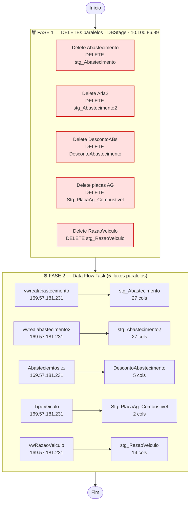

# ETL_Abastecimento — Documentação Técnica

> Package SSIS: `SSIS_stg_Abastecimento.dtsx`
> Criado em: 15/04/2024 | Autor: `GRUPOLCLOG\lucas.vilaca` | Máquina: `TLBARDIR21`
> Versão do produto: SQL Server Integration Services 16.0.5685.0 (SQL Server 2022)
> VersionBuild: 24 | DTSID: `{5A6BBBFB-DB4B-49CB-823E-F1A92EFAEBD6}`

---

## Objetivo

Carga full-refresh de dados de **Abastecimento de Veículos** do sistema SOFTRAN para a camada de **staging** (DBStage) no servidor DW.

O package carrega **5 tabelas staging em paralelo**, todas derivadas de views e tabelas do banco `softran_translute`:

| Tabela Staging | Origem |
|---|---|
| `dbo.stg_Abastecimento` | `dbo.vwrealabastecimento` |
| `dbo.stg_Abastecimento2` | `dbo.vwrealabastecimento2` |
| `dbo.DescontoAbastecimento` | `dbo.Abasteciemtos` ⚠️ |
| `dbo.Stg_PlacaAg_Combustivel` | `dbo.TipoVeiculo` |
| `dbo.stg_RazaoVeiculo` | `dbo.vwRazaoVeiculo` |

> ⚠️ Nome de tabela com erro de digitação: `Abasteciemtos` (faltam letras). Ver [issues_e_observacoes.md](issues_e_observacoes.md).

---

## Fluxo de Execução

```
┌─────────────────────────────────────────────────────────────────────────────┐
│  SERVIDOR ORIGEM                       SERVIDOR DESTINO                     │
│  169.57.181.231                        10.100.86.89                         │
│  softran_translute                     DBStage                              │
└─────────────────────────────────────────────────────────────────────────────┘

FASE 1 — 5 DELETEs em paralelo (Sequence Container)
┌──────────────┐  ┌──────────────┐  ┌────────────────┐  ┌──────────────────┐  ┌─────────────────┐
│Delete        │  │Delete        │  │Delete          │  │Delete            │  │Delete           │
│Abastecimento │  │Arla2         │  │DescontoABs     │  │placas AG         │  │RazaoVeiculo     │
│stg_Abastec.  │  │stg_Abastec.2 │  │DescontoAbastec.│  │Stg_PlacaAg_Comb.│  │stg_RazaoVeiculo │
│ThreadHint: 0 │  │ThreadHint: 1 │  │ThreadHint: 4   │  │ThreadHint: 3    │  │ThreadHint: 2    │
└──────┬───────┘  └──────┬───────┘  └───────┬────────┘  └────────┬─────────┘  └────────┬────────┘
       └──────────────────┴──────────────────┴───────────────────┴─────────────────────┘
                                             │ (todos com sucesso)
                                             ▼
FASE 2 — Data Flow Task (5 fluxos em paralelo)
┌────────────────────────┐  ┌────────────────────────┐  ┌────────────────────────┐
│ vwrealabastecimento    │  │ vwrealabastecimento2   │  │ Abasteciemtos ⚠️       │
│        ↓               │  │        ↓               │  │        ↓               │
│ stg_Abastecimento      │  │ stg_Abastecimento2     │  │ DescontoAbastecimento  │
│ 27 colunas             │  │ 27 colunas             │  │ 5 colunas              │
└────────────────────────┘  └────────────────────────┘  └────────────────────────┘
┌────────────────────────┐  ┌────────────────────────┐
│ TipoVeiculo            │  │ vwRazaoVeiculo         │
│        ↓               │  │        ↓               │
│ Stg_PlacaAg_Combustivel│  │ stg_RazaoVeiculo       │
│ 2 colunas              │  │ 14 colunas             │
└────────────────────────┘  └────────────────────────┘
```

### Diagrama Mermaid



---

## Sequência de Tasks

| Ordem | Task | Tipo | SQL / Ação | ThreadHint |
|:---:|---|---|---|:---:|
| 1a | **Delete Abastecimento** | Execute SQL Task | `DELETE FROM [dbo].[stg_Abastecimento]` | 0 |
| 1b | **Delete Arla2** | Execute SQL Task | `DELETE FROM [dbo].[stg_Abastecimento2]` | 1 |
| 1c | **Delete RazaoVeiculo** | Execute SQL Task | `DELETE FROM [dbo].[stg_RazaoVeiculo]` | 2 |
| 1d | **Delete placas AG** | Execute SQL Task | `DELETE FROM [dbo].[Stg_PlacaAg_Combustivel]` | 3 |
| 1e | **Delete DescontoABs** | Execute SQL Task | `DELETE FROM [dbo].[DescontoAbastecimento]` | 4 |
| 2 | **Tarefa Fluxo de Dados** | Data Flow Task | 5 fluxos paralelos (ver abaixo) | — |

As tasks 1a–1e executam **em paralelo** (ThreadHints diferentes dentro do Sequence Container). O Data Flow só inicia após **todas** completarem com sucesso (Precedence Constraint = Success + LogicalAnd).

---

## Arquivos de Documentação

| Arquivo | Conteúdo |
|---|---|
| [origem.md](origem.md) | Detalhe das 5 origens (views/tabelas do SOFTRAN) |
| [destino.md](destino.md) | Detalhe das 5 tabelas staging no DBStage |
| [transformacoes.md](transformacoes.md) | Transformações aplicadas |
| [mapeamento.md](mapeamento.md) | Tabela completa de mapeamento de colunas (75 colunas totais) |
| [issues_e_observacoes.md](issues_e_observacoes.md) | Issues identificados (incluindo typo crítico em nome de tabela) |

---

## Resumo das Conexões

| ID | Tipo | Servidor | Banco | Usuário | Usada em |
|---|---|---|---|---|---|
| `SOFTRAN - TRANSLUTE` | OLE DB (SQLOLEDB.1) | 169.57.181.231 | softran_translute | softran | Todos os Sources |
| `DBSTAGE` | OLE DB (SQLOLEDB.1) | 10.100.86.89 | DBStage | sqldba | Todos os Destinations + DELETEs |

> **Atenção**: O destino é `DBStage`, não `DWGrupolc`. Este é um ETL de **staging** — os dados precisam de uma segunda etapa de transformação/carga para chegar ao DW final.

---

## Variáveis

Nenhuma variável declarada no package (`DTS:Variables` vazio).
