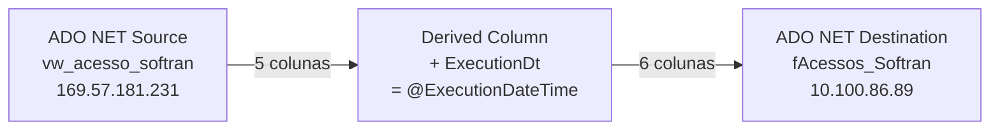

# ETL_Acessos — Documentação Técnica

> Package SSIS: `ETL_Acessos.dtsx`
> Criado em: 28/05/2025 14:15:09 | Autor: GRUPOLCLOG\luiz.costa | Máquina: D2-WV47-DB01
> Versão: 16.0.5685.0

## Objetivo

Package responsável por extrair dados de acessos ao sistema Softran (via view `vw_acesso_softran` no servidor 169.57.181.231) e carregá-los na tabela `fAcessos_Softran` no Data Warehouse (servidor 10.100.86.89, banco DWGrupolc). Durante o carregamento, uma coluna calculada `ExecutionDt` é adicionada com a data/hora de execução do package.

## Fluxo de Execução

```
[ADO NET Source]          [Derived Column]        [ADO NET Destination]
 vw_acesso_softran   -->   + ExecutionDt      -->   fAcessos_Softran
 (169.57.181.231)          (@ExecutionDateTime)      (10.100.86.89)
```



## Sequência de Tasks

| Ordem | Task | Tipo | SQL/Ação | ThreadHint |
|-------|------|------|----------|------------|
| 1 | Load fPerf | Data Flow Task | Extrai de `vw_acesso_softran`, adiciona `ExecutionDt`, carrega `fAcessos_Softran` | — |

> Nota: não há Sequence Container nem Execute SQL Tasks neste package. O Data Flow é o único executável no nível de Package.

## Arquivos de Documentação

| Arquivo | Conteúdo |
|---------|----------|
| [origem.md](./origem.md) | Servidor de origem, view e colunas de entrada |
| [destino.md](./destino.md) | Tabela destino e estratégia de carga |
| [transformacoes.md](./transformacoes.md) | Derived Column e mapeamento de fluxo |
| [mapeamento.md](./mapeamento.md) | Mapeamento completo de colunas |
| [issues_e_observacoes.md](./issues_e_observacoes.md) | Issues encontrados e checklist de melhoria |

## Resumo das Conexões

| ID | Nome | Tipo | Servidor | Banco | Usuário | Usada em |
|----|------|------|----------|-------|---------|----------|
| 1 | 10.100.86.89.DWGrupolc.datalc | ADO.NET (SqlClient) | 10.100.86.89 | DWGrupolc | datalc | ADO NET Destination |
| 2 | 10.100.86.89.DWGrupolc.sqldba1 | OLEDB (SQLNCLI11.1) | 10.100.86.89 | DWGrupolc | sqldba | Não utilizada diretamente no fluxo |
| 3 | 169.57.181.231.SOFTRAN_TRANSLUTE.datalc | ADO.NET (SqlClient) | 169.57.181.231 | SOFTRAN_TRANSLUTE | softran | ADO NET Source |

## Variáveis

| Nome | Namespace | Tipo | Expressão / Valor Padrão | Observação |
|------|-----------|------|--------------------------|------------|
| ExecutionDateTime | User | DateTime (7) | `GETDATE()` | Usada no Derived Column para gerar `ExecutionDt` |
| StartDate | User | DateTime (7) | 01/01/2025 | Declarada mas **não utilizada** no fluxo atual |
