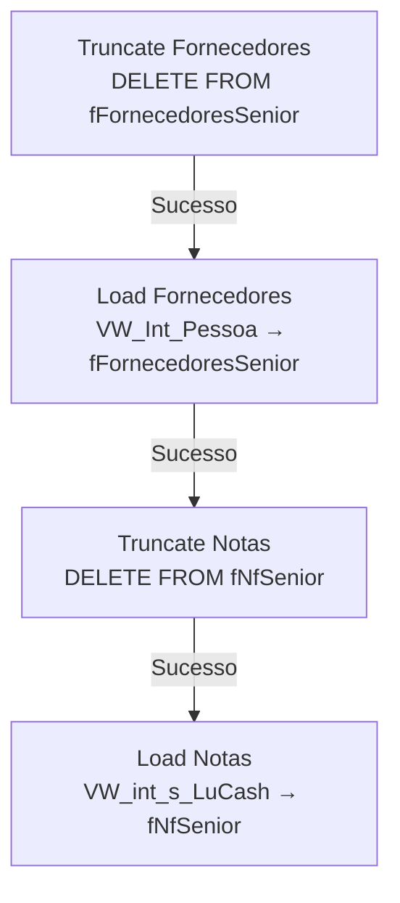

# ETL_Antecipa — Documentação Técnica

> Package SSIS: `ETL_Antecipa.dtsx`
> Criado em: 14/11/2025 09:10:15 | Autor: GRUPOLCLOG\datapartners.lucas | Máquina: D2-WV47-DB01
> Versão: 16.0.5685.0

## Objetivo

Package responsável por carregar dados do sistema de antecipação de recebíveis (Softran/LuCash) para a área de Stage do Data Warehouse (DBStage). Extrai dados de **fornecedores** (pessoas/empresas) e **notas fiscais com títulos** do servidor Softran, apagando os dados existentes antes de recarregar integralmente (estratégia DELETE + INSERT).

## Fluxo de Execução

```
Sequence Container 1
├── [Truncate Fornecedores] ──► [Load Fornecedores]
│                                      │
└── [Truncate Notas] ◄──────────────────┘
        │
        └──► [Load Notas]
```



## Sequência de Tasks

| Ordem | Task | Tipo | SQL/Ação | ThreadHint |
|-------|------|------|----------|------------|
| 1 | Truncate Fornecedores | Execute SQL | `DELETE FROM fFornecedoresSenior` | 0 |
| 2 | Load Fornecedores | Data Flow Task | VW_Int_Pessoa → fFornecedoresSenior (4 col.) | — |
| 3 | Truncate Notas | Execute SQL | `DELETE FROM dbo.fNfSenior` | 0 |
| 4 | Load Notas | Data Flow Task | VW_int_s_LuCash → fNfSenior (14 col.) | — |

> Nota: As tasks Truncate Fornecedores e Truncate Notas são executadas em série por PrecedenceConstraints. Load Fornecedores precede Truncate Notas, garantindo que os dados de fornecedores são carregados antes de limpar e recarregar as notas.

## Arquivos de Documentação

| Arquivo | Conteúdo |
|---------|----------|
| [origem.md](./origem.md) | Servidor de origem, views e colunas de entrada |
| [destino.md](./destino.md) | Tabelas destino e estratégia de carga |
| [transformacoes.md](./transformacoes.md) | Fluxo passthrough, sem transformações |
| [mapeamento.md](./mapeamento.md) | Mapeamento completo de colunas por fluxo |
| [issues_e_observacoes.md](./issues_e_observacoes.md) | Issues encontrados e checklist de melhoria |

## Resumo das Conexões

| ID | Nome | Tipo | Servidor | Banco | Usuário | Usada em |
|----|------|------|----------|-------|---------|----------|
| 1 | 10.100.86.89.DBStage.sqldba 1 | ADO.NET (SqlClient) | 10.100.86.89 | DBStage | sqldba | Execute SQL Tasks + Destinations |
| 2 | 169.57.181.231.SOFTRAN_TRANSLUTE.datalc | ADO.NET (SqlClient) | 169.57.181.231 | SOFTRAN_TRANSLUTE | softran | ADO NET Sources |

## Variáveis

Nenhuma variável declarada neste package (`<DTS:Variables />`).
