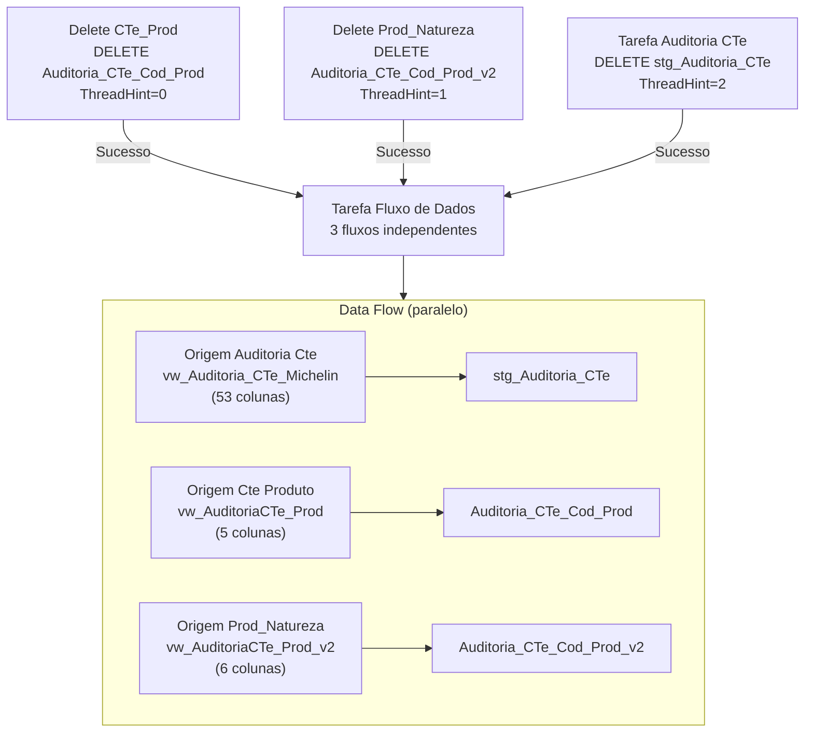

# ETL_Auditoria_CTe — Documentação Técnica

> Package SSIS: `ETL_Auditoria_CTE.dtsx`
> Criado em: 01/04/2024 17:32:18 | Autor: GRUPOLCLOG\lucas.vilaca | Máquina: TLBARDIR21
> Versão: 16.0.5685.0

## Objetivo

Package responsável por extrair dados de auditoria de CT-e (Conhecimento de Transporte Eletrônico) do sistema Softran para a área de Stage do DW (servidor 10.100.86.89, banco DBStage). Carrega três tabelas de staging:
- `stg_Auditoria_CTe`: dados principais do CT-e para clientes Michelin
- `Auditoria_CTe_Cod_Prod`: codigos de produto por CT-e
- `Auditoria_CTe_Cod_Prod_v2`: codigos de produto com natureza (versao 2)

Todos os dados são deletados antes de recarregar integralmente (estratégia DELETE + INSERT em paralelo para as tabelas de produtos).

## Fluxo de Execução

```
Contêiner da Sequência
├── [Delete CTe_Prod]      (ThreadHint=0) ─┐
├── [Delete Prod_Natureza] (ThreadHint=1) ─┤── executam em paralelo
└── [Tarefa Auditoria CTe] (ThreadHint=2) ─┘
         ↓ (todos devem completar)
    [Tarefa Fluxo de Dados]
     ├── Origem Auditoria Cte  → Destino OLE DB   (stg_Auditoria_CTe)
     ├── Origem Cte Produto    → Destino OLE DB 1  (Auditoria_CTe_Cod_Prod)
     └── Origem Prod_Natureza  → Destino OLE DB 2  (Auditoria_CTe_Cod_Prod_v2)
```



## Sequência de Tasks

| Ordem | Task | Tipo | SQL/Acao | ThreadHint |
|-------|------|------|----------|------------|
| 1 | Delete CTe_Prod | Execute SQL | `Delete from [dbo].[Auditoria_CTe_Cod_Prod]` | 0 |
| 1 | Delete Prod_Natureza | Execute SQL | `Delete from [Auditoria_CTe_Cod_Prod_v2]` | 1 |
| 1 | Tarefa Auditoria CTe | Execute SQL | `Delete from [dbo].[stg_Auditoria_CTe]` | 2 |
| 2 | Tarefa Fluxo de Dados | Data Flow Task | 3 fluxos em paralelo (53+5+6 colunas) | — |

> Os ThreadHints 0, 1 e 2 indicam que as 3 tasks Delete podem ser executadas em paralelo pelo SSIS. O Data Flow inicia apenas após a conclusao das 3 tasks Delete (LogicalAnd=True em todos os PrecedenceConstraints).

## Arquivos de Documentação

| Arquivo | Conteudo |
|---------|----------|
| [origem.md](./origem.md) | Servidor de origem, views e colunas de entrada (3 sources) |
| [destino.md](./destino.md) | Tabelas de staging e estrategia de carga |
| [transformacoes.md](./transformacoes.md) | Fluxo passthrough, sem transformacoes |
| [mapeamento.md](./mapeamento.md) | Mapeamento completo de colunas (64 colunas totais) |
| [issues_e_observacoes.md](./issues_e_observacoes.md) | Issues encontrados e checklist de melhoria |

## Resumo das Conexoes

| ID | Nome | Tipo | Servidor | Banco | Usuario | Usada em |
|----|------|------|----------|-------|---------|----------|
| 1 | DBSTAGE | OLEDB (SQLOLEDB.1) | 10.100.86.89 | DBStage | sqldba | Execute SQL Tasks + Destinations |
| 2 | SOFTRAN - TRANSLUTE | OLEDB (SQLOLEDB.1) | 169.57.181.231 | softran_translute | softran | OLE DB Sources |

## Variaveis

Nenhuma variavel declarada neste package (`<DTS:Variables />`).
