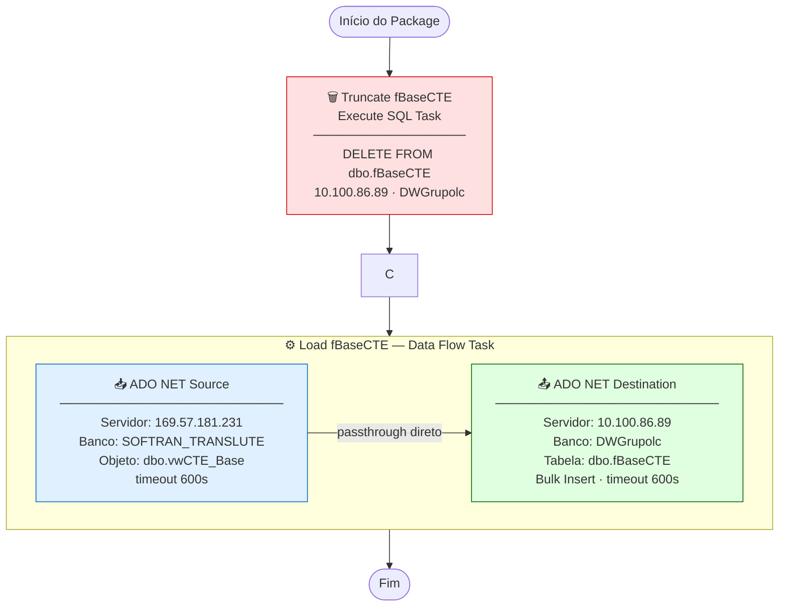

# ETL_BaseCTE — Documentação Técnica

> Package SSIS: `ETL_BaseCTE.dtsx`
> Servidor de execução: `10.100.86.89` (D2-WV47-DB01)
> Versão: SQL Server Integration Services 16.0 (SQL Server 2022)

---

## Objetivo

Carga full-refresh da tabela de **CT-e Base** (Conhecimentos de Transporte Eletrônico) do sistema operacional SOFTRAN para o Data Warehouse corporativo DWGrupolc.

Esta é a **principal tabela fato** do DW — alimenta o Dashboard Executivo de Gestão de Terceiros com comparativos 2024 × 2025 × 2026 de receita, frete, margem e volume de CTEs por mês, filial, UF e tipo de frete.

---

## Fluxo de Execução

```
┌─────────────────────────────────────────────────────────────────────────┐
│  SERVIDOR ORIGEM                    SERVIDOR DESTINO                    │
│  169.57.181.231                     10.100.86.89                        │
│  SOFTRAN_TRANSLUTE                  DWGrupolc                           │
│                                                                         │
│  ┌──────────────────────┐           ┌─────────────────────────────┐    │
│  │  dbo.vwCTE_Base      │           │  dbo.fBaseCTE               │    │
│  │  (view consolidada)  │           │  (tabela fato DW)           │    │
│  └──────────┬───────────┘           └──────────────┬──────────────┘    │
│             │                                      │                    │
└─────────────┼──────────────────────────────────────┼────────────────────┘
              │                                      │
              ▼                                      ▼
   ╔══════════════════════╗         ╔════════════════════════════╗
   ║  [1] TRUNCATE        ║         ║  [2] LOAD fBaseCTE         ║
   ║  Execute SQL Task    ║ ──────► ║  Data Flow Task            ║
   ║                      ║         ║                            ║
   ║  DELETE FROM         ║         ║  ADO NET Source            ║
   ║  dbo.fBaseCTE        ║         ║       │                    ║
   ╚══════════════════════╝         ║       ▼                    ║
                                    ║  ADO NET Destination       ║
                                    ╚════════════════════════════╝
```

### Diagrama Mermaid



---

## Sequência de Tasks

| Ordem | Task | Tipo | Ação |
|:---:|---|---|---|
| 1 | **Truncate fBaseCTE** | Execute SQL Task | `DELETE FROM dbo.fBaseCTE` — remove todos os registros |
| 2 | **Load fBaseCTE** | Data Flow Task | Lê view de origem e insere na tabela destino |

Task 2 executa apenas após sucesso da task 1 (Precedence Constraint = Success).

---

## Arquivos de Documentação

| Arquivo | Conteúdo |
|---|---|
| [origem.md](origem.md) | Detalhe da fonte de dados (servidor, view, colunas) |
| [destino.md](destino.md) | Detalhe do destino (servidor, tabela, comportamento de carga) |
| [transformacoes.md](transformacoes.md) | Transformações aplicadas (e ausência delas) |
| [mapeamento.md](mapeamento.md) | Tabela completa de mapeamento de colunas |
| [issues_e_observacoes.md](issues_e_observacoes.md) | Issues identificados e recomendações |

---

## Resumo das Conexões

| ID | Tipo | Servidor | Banco | Usuário | Usada em |
|---|---|---|---|---|---|
| `datalc` (SOFTRAN) | ADO.NET | 169.57.181.231 | SOFTRAN_TRANSLUTE | softran | Source do Data Flow |
| `datalc` (DW) | ADO.NET | 10.100.86.89 | DWGrupolc | sqldba | Destination do Data Flow |
| `sqldba1` | OLE DB | 10.100.86.89 | DWGrupolc | sqldba | Execute SQL (DELETE) |

---

## Impacto no Dashboard

`fBaseCTE` alimenta diretamente o **Dashboard Executivo de Gestão de Terceiros**:

| Seção | Dados consumidos |
|---|---|
| KPIs principais | Total CTEs, Receita, Frete, Margem R$, Margem % |
| Comparativo 3 anos | Receita mensal 2024 × 2025 × 2026 |
| Breakdown por filial | CTEs, Receita, Margem% — CGR, NOD, BAR, RES, SSA, SBC, POA, REC, CWB, LC2, VIX |
| Breakdown por UF destino | SP, RJ, BA, PR, PE, MG, CE, ES, RS |
| Tipo de frete | Carga (C) vs Fracionado (F) |
| Vínculo motorista | Terceiro vs Funcionário |
| Ticket médio mensal | Receita / CTEs por mês, 3 anos |
