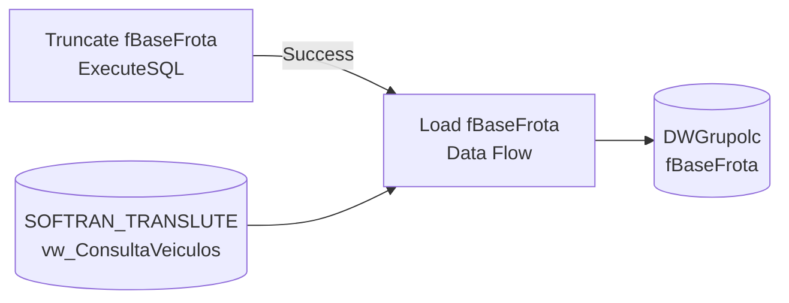

# ETL_BaseFrota — Documentação do Package SSIS

## Metadados

| Campo | Valor |
|---|---|
| ObjectName | ETL_BaseFrota |
| CreationDate | 26/08/2025 12:03:47 |
| CreatorName | GRUPOLCLOG\luiz.costa |
| CreatorComputerName | D2-WV47-DB01 |
| LastModifiedProductVersion | 16.0.5685.0 (SQL Server 2022) |
| VersionBuild | 7 |
| ProtectionLevel | EncryptSensitiveWithUserKey |
| LocaleID | 1046 (Português - Brasil) |

## Objetivo

Carrega a tabela dimensional `fBaseFrota` no DW (DWGrupolc) com dados completos de veículos da frota, extraídos da view `vw_ConsultaVeiculos` no sistema SOFTRAN (SOFTRAN_TRANSLUTE). O processo aplica truncate na tabela de destino antes da carga, garantindo recarga completa a cada execução.

## Diagrama ASCII do Fluxo (Control Flow)

```
+----------------------+       Constraint (Success)       +--------------------+
|  Truncate fBaseFrota |  -------------------------------->|  Load fBaseFrota   |
|  (ExecuteSQL Task)   |                                  |  (Data Flow Task)  |
+----------------------+                                  +--------------------+
```

## Diagrama Mermaid



## Tabela de Tasks

| # | Nome | Tipo | Conexao | SQL / Detalhe | ThreadHint |
|---|---|---|---|---|---|
| 1 | Truncate fBaseFrota | ExecuteSQL | 10.100.86.89.DWGrupolc.sqldba1 (OLEDB) | `TRUNCATE TABLE "fBaseFrota"` | 0 |
| 2 | Load fBaseFrota | Pipeline (Data Flow) | Origem: SOFTRAN / Destino: DWGrupolc | vw_ConsultaVeiculos → fBaseFrota | — |

## Tabela de Conexoes

| Nome | Tipo | Servidor | Banco | Usuario |
|---|---|---|---|---|
| 10.100.86.89.DWGrupolc.sqldba | ADO.NET (SqlClient) | 10.100.86.89 | DWGrupolc | sqldba |
| 10.100.86.89.DWGrupolc.sqldba1 | OLEDB (SQLNCLI11.1) | 10.100.86.89 | DWGrupolc | sqldba |
| 169.57.181.231.SOFTRAN_TRANSLUTE.datalc | ADO.NET (SqlClient) | 169.57.181.231 | SOFTRAN_TRANSLUTE | softran |

## Variaveis

Nenhuma variavel definida no package (`<DTS:Variables />`).

## Precedence Constraints

| De | Para | Tipo | Logica |
|---|---|---|---|
| Truncate fBaseFrota | Load fBaseFrota | Success | AND |
