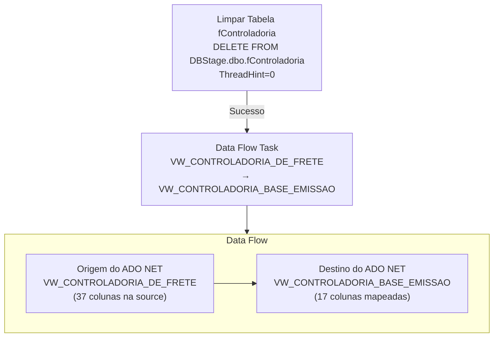

# ETL_Base_Controladoria — Documentação Técnica

> Package SSIS: `ETL_Base_Controladoria.dtsx` (ObjectName interno: `Package2`)
> Criado em: 20/01/2026 10:29:16 | Autor: GRUPOLCLOG\MAURICIO.FREITAS | Máquina: D2-WV47-DB01
> Versão: 16.0.5685.0

## Objetivo

Package responsável por carregar a base de dados de controladoria de frete para uma view gerenciável no DBStage. Extrai dados da view `VW_CONTROLADORIA_DE_FRETE` no servidor Softran (169.57.181.231) e carrega na view `VW_CONTROLADORIA_BASE_EMISSAO` no servidor DBStage (10.100.86.89, banco DBStage). A tabela destino fisica e `fControladoria`, que e limpa antes de cada carga.

A source possui **37 colunas** mas o destino mapeia apenas **17 colunas** (carga seletiva — apenas campos necessarios para o relatorio de controladoria de emissao).

## Fluxo de Execução

```
Contêiner da Sequência
├── [Limpar Tabela fControladoria]  ──► [Data Flow Task]
      DELETE FROM fControladoria           │
                                  VW_CONTROLADORIA_DE_FRETE
                                  (37 col. na source)
                                          ↓ (17 mapeadas)
                                  VW_CONTROLADORIA_BASE_EMISSAO
```



## Sequência de Tasks

| Ordem | Task | Tipo | SQL/Acao | ThreadHint |
|-------|------|------|----------|------------|
| 1 | Limpar Tabela fControladoria | Execute SQL | `DELETE FROM [DBStage].[dbo].[fControladoria]` | 0 |
| 2 | Data Flow Task | Data Flow | VW_CONTROLADORIA_DE_FRETE → VW_CONTROLADORIA_BASE_EMISSAO (17 col.) | — |

## Arquivos de Documentação

| Arquivo | Conteudo |
|---------|----------|
| [origem.md](./origem.md) | Servidor de origem, view e todas as 37 colunas extraidas |
| [destino.md](./destino.md) | View/tabela destino, 17 colunas mapeadas |
| [transformacoes.md](./transformacoes.md) | Carga seletiva — 37 colunas source, 17 mapeadas |
| [mapeamento.md](./mapeamento.md) | Mapeamento completo com indicacao de colunas ignoradas |
| [issues_e_observacoes.md](./issues_e_observacoes.md) | Issues criticos encontrados (datas como string, etc.) |

## Resumo das Conexoes

| ID | Nome | Tipo | Servidor | Banco | Usuario | Usada em |
|----|------|------|----------|-------|---------|----------|
| 1 | 10.100.86.89 | ADO.NET (SqlClient) | 10.100.86.89 | DBStage | sqldba | ADO NET Destination |
| 2 | 10.100.86.89 1 | ADO.NET (SqlClient) | 10.100.86.89 | (nao especificado) | sqldba | Execute SQL Task (Limpar) |
| 3 | 169.57.181.231.SOFTRAN_TRANSLUTE.softran | ADO.NET (SqlClient) | 169.57.181.231 | SOFTRAN_TRANSLUTE | softran | ADO NET Source |
| 4 | DBStage | ADO.NET ODBC | 10.100.86.89 | DBStage (via DSN) | sqldba | Nao utilizada no fluxo |

## Variaveis

Nenhuma variavel declarada (`<DTS:Variables />`).

## Parametros do Package

| Parametro | Tipo | Valor Padrao | Descricao |
|-----------|------|--------------|-----------|
| ContInerDaSequNcia_DelayValidation | Boolean (11) | 0 (False) | Controla DelayValidation do Sequence Container |

> Nota: O nome do parametro (`ContInerDaSequNcia_DelayValidation`) contem erros de acentuacao — "ContIner" em vez de "Contêiner" e "SequNcia" em vez de "Sequência". Isso e um bug de encoding no nome do parametro.
