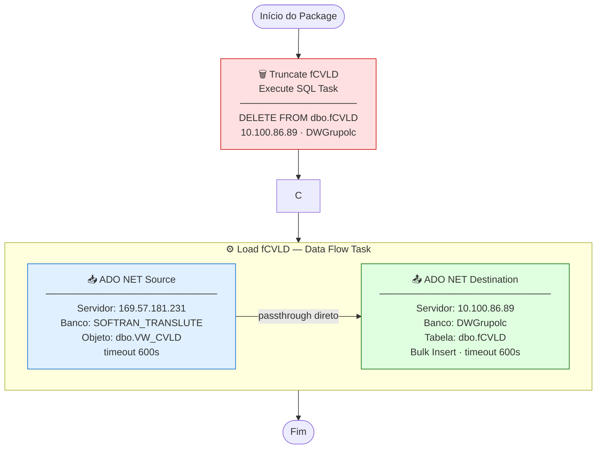

# ETL_CVLD — Documentação Técnica

> Package SSIS: `ETL_CVLD.dtsx`
> Servidor de execução: `10.100.86.89` (D2-WV47-DB01)
> Versão: SQL Server Integration Services 16.0 (SQL Server 2022)

---

## Objetivo

Carga full-refresh da tabela de **Custo CTRB de Terceiros** (Contratos de Transporte Rodoviário de Bens) do sistema SOFTRAN para o Data Warehouse corporativo DWGrupolc.

Os dados desta tabela alimentam a seção **"Análise de Terceiros — Custo CTRB"** do Dashboard Executivo, incluindo o ranking de transportadoras, custo de aluguel de carretas, composição de custos (frete, pedágio, INSS, SEST/SENAT, IRRF) e ticket médio por viagem.

---

## Fluxo de Execução

```
┌─────────────────────────────────────────────────────────────────────────┐
│  SERVIDOR ORIGEM                    SERVIDOR DESTINO                    │
│  169.57.181.231                     10.100.86.89                        │
│  SOFTRAN_TRANSLUTE                  DWGrupolc                           │
│                                                                         │
│  ┌──────────────────────┐           ┌─────────────────────────────┐    │
│  │  dbo.VW_CVLD         │           │  dbo.fCVLD                  │    │
│  │  (view CTRB)         │           │  (tabela DW)                │    │
│  └──────────┬───────────┘           └──────────────┬──────────────┘    │
│             │                                      │                    │
└─────────────┼──────────────────────────────────────┼────────────────────┘
              │                                      │
              ▼                                      ▼
   ╔══════════════════════╗         ╔════════════════════════════╗
   ║  [1] TRUNCATE        ║         ║  [2] LOAD fCVLD            ║
   ║  Execute SQL Task    ║ ──────► ║  Data Flow Task            ║
   ║                      ║         ║                            ║
   ║  DELETE FROM         ║         ║  ADO NET Source            ║
   ║  dbo.fCVLD           ║         ║       │                    ║
   ╚══════════════════════╝         ║       ▼                    ║
                                    ║  ADO NET Destination       ║
                                    ╚════════════════════════════╝
```

### Diagrama Mermaid



---

## Sequência de Tasks

| Ordem | Task | Tipo | Ação |
|:---:|---|---|---|
| 1 | **Truncate fCVLD** | Execute SQL Task | `DELETE FROM dbo.fCVLD` — remove todos os registros |
| 2 | **Load fCVLD** | Data Flow Task | Lê view VW_CVLD e insere na tabela destino |

---

## Arquivos de Documentação

| Arquivo | Conteúdo |
|---|---|
| [origem.md](origem.md) | Detalhe da fonte de dados (servidor, view VW_CVLD, colunas) |
| [destino.md](destino.md) | Detalhe do destino (tabela fCVLD, comportamento de carga) |
| [transformacoes.md](transformacoes.md) | Transformações aplicadas |
| [mapeamento.md](mapeamento.md) | Mapeamento completo de colunas |
| [issues_e_observacoes.md](issues_e_observacoes.md) | Issues e recomendações |

---

## Resumo das Conexões

| ID | Tipo | Servidor | Banco | Usuário | Usada em |
|---|---|---|---|---|---|
| `datalc` (SOFTRAN) | ADO.NET | 169.57.181.231 | SOFTRAN_TRANSLUTE | softran | Source do Data Flow |
| `datalc` (DW) | ADO.NET | 10.100.86.89 | DWGrupolc | sqldba | Destination do Data Flow |
| `sqldba1` | OLE DB | 10.100.86.89 | DWGrupolc | sqldba | Execute SQL (DELETE) |

---

## Impacto no Dashboard

`fCVLD` alimenta a seção **Análise de Terceiros** do Dashboard Executivo:

| Visualização | Dados consumidos |
|---|---|
| Top 10 Transportadoras | Custo frete pago + saldo a pagar por transportadora |
| Aluguel de Carretas | Valor total, viagens, média por viagem por filial |
| Evolução mensal aluguel | Jan–Mai/2026 — valor e número de viagens |
| Composição do custo CTRB | Frete, pedágio, INSS, SEST/SENAT, aluguel, IRRF |
| KPI Custo Total CTRB | R$ 150M (Jan–Mai/2026) |
