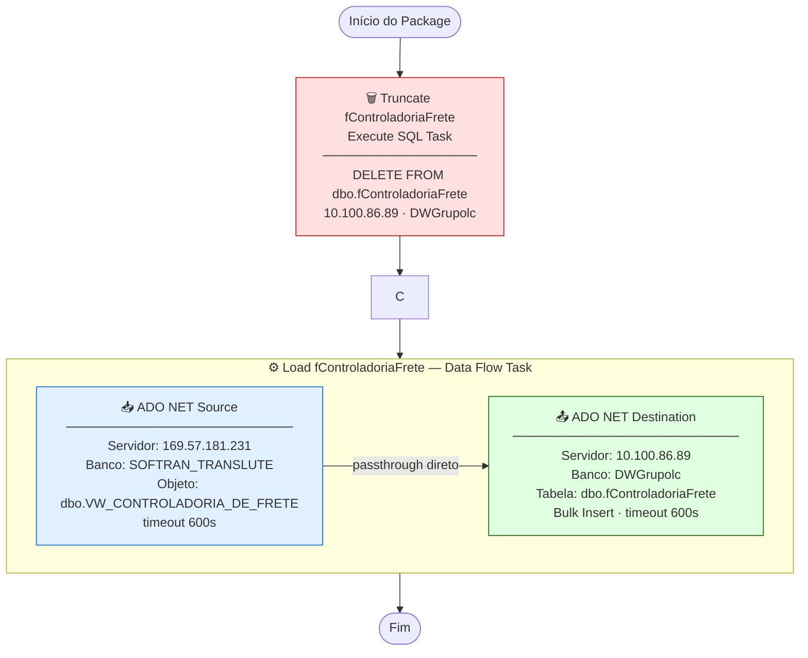

# ETL_ControladoriaFrete — Documentação Técnica

> Package SSIS: `ETL_ControladoriaFrete.dtsx`
> Servidor de execução: `10.100.86.89` (D2-WV47-DB01)
> Versão: SQL Server Integration Services 16.0 (SQL Server 2022)

---

## Objetivo

Carga full-refresh da tabela de **Controladoria de Frete** do sistema SOFTRAN para o Data Warehouse corporativo DWGrupolc.

Os dados desta tabela permitem a análise de **resultado financeiro por operação**, cruzando receita (CT-e) com custo (CTRB) em nível de viagem/ficha, possibilitando o cálculo de margem real por filial, cliente, rota e motorista.

---

## Fluxo de Execução

```
┌─────────────────────────────────────────────────────────────────────────┐
│  SERVIDOR ORIGEM                    SERVIDOR DESTINO                    │
│  169.57.181.231                     10.100.86.89                        │
│  SOFTRAN_TRANSLUTE                  DWGrupolc                           │
│                                                                         │
│  ┌──────────────────────┐           ┌─────────────────────────────┐    │
│  │  dbo.VW_CONTROLADORIA│           │  dbo.fControladoriaFrete     │    │
│  │  _DE_FRETE (view)    │           │  (tabela DW)                │    │
│  └──────────┬───────────┘           └──────────────┬──────────────┘    │
│             │                                      │                    │
└─────────────┼──────────────────────────────────────┼────────────────────┘
              │                                      │
              ▼                                      ▼
   ╔══════════════════════╗         ╔════════════════════════════╗
   ║  [1] TRUNCATE        ║         ║  [2] LOAD fControladoria   ║
   ║  Execute SQL Task    ║ ──────► ║  Data Flow Task            ║
   ║                      ║         ║                            ║
   ║  DELETE FROM         ║         ║  ADO NET Source            ║
   ║  dbo.fControladoria  ║         ║       │                    ║
   ║  Frete               ║         ║       ▼                    ║
   ╚══════════════════════╝         ║  ADO NET Destination       ║
                                    ╚════════════════════════════╝
```

### Diagrama Mermaid



---

## Sequência de Tasks

| Ordem | Task | Tipo | Ação |
|:---:|---|---|---|
| 1 | **Truncate fControladoriaFrete** | Execute SQL Task | `DELETE FROM dbo.fControladoriaFrete` |
| 2 | **Load fControladoriaFrete** | Data Flow Task | Lê `VW_CONTROLADORIA_DE_FRETE` e insere no destino |

---

## Arquivos de Documentação

| Arquivo | Conteúdo |
|---|---|
| [origem.md](origem.md) | Detalhe da fonte de dados (view VW_CONTROLADORIA_DE_FRETE) |
| [destino.md](destino.md) | Detalhe do destino (tabela fControladoriaFrete) |
| [transformacoes.md](transformacoes.md) | Transformações aplicadas |
| [mapeamento.md](mapeamento.md) | Mapeamento completo de colunas |
| [issues_e_observacoes.md](issues_e_observacoes.md) | Issues e recomendações |

---

## Resumo das Conexões

| ID | Tipo | Servidor | Banco | Usuário | Usada em |
|---|---|---|---|---|---|
| `datalc` (SOFTRAN) | ADO.NET | 169.57.181.231 | SOFTRAN_TRANSLUTE | softran | Source do Data Flow |
| `datalc` (DW) | ADO.NET | 10.100.86.89 | DWGrupolc | sqldba | Destination do Data Flow |
| `sqldba1` | OLE DB | 10.100.86.89 | DWGrupolc | sqldba | Execute SQL (DELETE) |

---

## Relação com Outros ETLs

`fControladoriaFrete` cruza dados das duas outras tabelas fato do DW:

```
fBaseCTE              fFichaViagem          fCVLD
(receita CT-e)   +    (ficha viagem)   +    (custo CTRB)
      │                    │                    │
      └────────────────────┴────────────────────┘
                           │
                    fControladoriaFrete
                  (margem real por viagem)
```

**Dependência de ordem de execução**: este ETL deve ser executado **após** `ETL_BaseCTE`, `ETL_Fichas` e `ETL_CVLD` terem concluído com sucesso.
