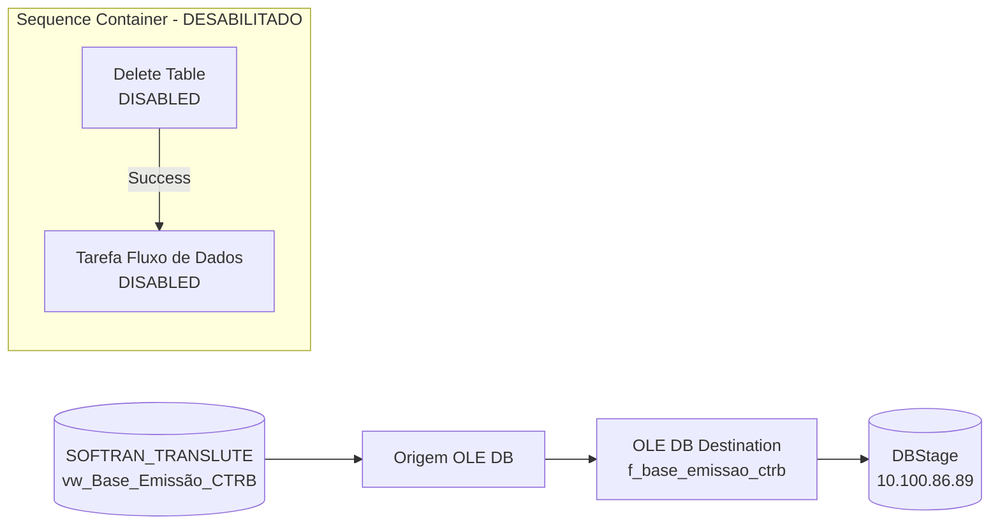

# ETL_Emissao_CTRB — Documentacao do Package SSIS

## Metadados

| Campo | Valor |
|---|---|
| ObjectName (arquivo) | ETL_Emissao_CTRB (arquivo: SSIS_stg_Emissao_CTRB_Atual) |
| ObjectName (interno) | SSIS_stg_Emissao_CTRB_Atual |
| CreationDate | 01/02/2024 15:07:17 |
| CreatorName | GRUPOLCLOG\lucas.vilaca |
| CreatorComputerName | TLBARDIR21 |
| LastModifiedProductVersion | 16.0.5685.0 (SQL Server 2022) |
| VersionBuild | 109 |
| ProtectionLevel | 0 (DontSaveSensitive) |
| DisableEventHandlers | True |

## Objetivo

Carrega a tabela `f_base_emissao_ctrb` (e secundariamente `stg_Base_Emissão_CTRB`) no servidor 10.100.86.89 (DBStage) com dados de emissao de conhecimentos de transporte (CTRB — Contrato de Transportador Autonomo) extraidos da view `vw_Base_Emissão_CTRB` no sistema SOFTRAN (SOFTRAN_TRANSLUTE / softran_translute). O package possui um Sequence Container com duas tasks dentro.

## Diagrama ASCII do Fluxo (Control Flow)

```
+------------------------------------------+
|     Contêiner da Sequência               |
|                                          |
|  +------------------+   Restrição        |
|  |  Delete Table    |  (Success)         |
|  |  (DESABILITADA)  | ------------>      |
|  +------------------+                   |
|                                          |
|  +-----------------------------+         |
|  | Tarefa Fluxo de Dados       |         |
|  | (DESABILITADA)              |         |
|  +-----------------------------+         |
+------------------------------------------+
```

> ATENCAO: Ambas as tasks dentro do Sequence Container estao com `DTS:Disabled="True"`.
> Existe tambem o Data Flow principal (ativo) que usa a view `vw_Base_Emissão_CTRB`.

## Diagrama Mermaid



## Tabela de Tasks

| # | Nome | Tipo | Container | Status | SQL / Detalhe |
|---|---|---|---|---|---|
| 1 | Delete Table | ExecuteSQL | Contêiner da Sequência | **DESABILITADO** | `delete FROM [dbo].[stg_Base_Emissão_CTRB]` |
| 2 | Tarefa Fluxo de Dados | Pipeline (Data Flow) | Contêiner da Sequência | **DESABILITADO** | `[dbo].[f_base_emissao_ctrb]` |
| — | Fluxo principal | Pipeline (Data Flow) | Package raiz | Ativo | `vw_Base_Emissão_CTRB` → destinos |

## Tabela de Conexoes

| Nome | Tipo | Servidor | Banco | Usuario |
|---|---|---|---|---|
| 10.100.86.89 | ADO.NET (SqlClient) | 10.100.86.89 | — (sem Initial Catalog) | sqldba |
| 10.100.86.89.DBStage.sqldba | OLEDB (MSOLEDBSQL.1) | 10.100.86.89 | DBStage | sqldba |
| 10.100.86.89.DBStage.sqldba 1 | OLEDB (MSOLEDBSQL.1) | 10.100.86.89 | DBStage | sqldba |
| 169.57.181.231.SOFTRAN_TRANSLUTE.softran | ADO.NET (SqlClient) | 169.57.181.231 | SOFTRAN_TRANSLUTE | softran |
| 169.57.181.231.SOFTRAN_TRANSLUTE.softran 1 | ADO.NET (SqlClient) | 169.57.181.231 | SOFTRAN_TRANSLUTE | softran |
| DBStage | ODBC | 10.100.86.89 | DBStage | sqldba |
| DBSTAGE | OLEDB (SQLOLEDB.1) | 10.100.86.89 | DBStage | sqldba |
| SOFTRAN - TRANSLUTE | OLEDB (SQLOLEDB.1) | 169.57.181.231 | softran_translute | softran |

## Variaveis

Nenhuma variavel definida no package.

## Precedence Constraints

| De | Para | Container | Tipo |
|---|---|---|---|
| Delete Table | Tarefa Fluxo de Dados | Contêiner da Sequência | Success (Restrição) |
