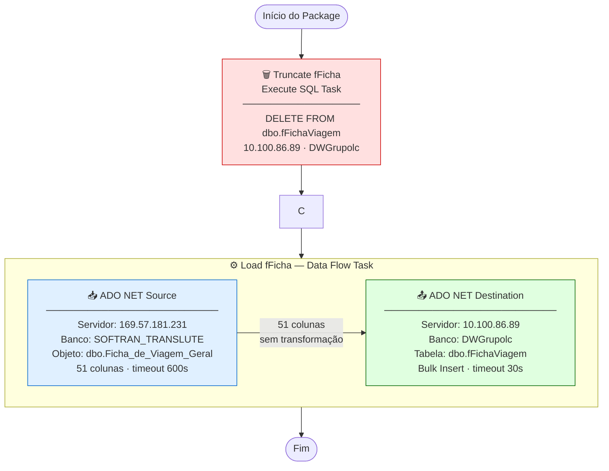

# ETL_Fichas — Documentação Técnica

> Package SSIS: `ETL_Fichas.dtsx`
> Criado em: 28/05/2025 | Autor: `GRUPOLCLOG\luiz.costa` | Máquina: `D2-WV47-DB01`
> Versão do produto: SQL Server Integration Services 16.0.5685.0 (SQL Server 2022)

---

## Objetivo

Carga full-refresh da tabela de **Fichas de Viagem** do sistema operacional (SOFTRAN) para o Data Warehouse corporativo (DWGrupolc).

O package apaga todos os registros da tabela de destino e recarrega com os dados atuais da view de origem — sem transformações intermediárias.

---

## Fluxo de Execução

```
┌─────────────────────────────────────────────────────────────────────────┐
│  SERVIDOR ORIGEM                    SERVIDOR DESTINO                    │
│  169.57.181.231                     10.100.86.89                        │
│  SOFTRAN_TRANSLUTE                  DWGrupolc                           │
│                                                                         │
│  ┌──────────────────────┐           ┌─────────────────────────────┐    │
│  │  dbo.Ficha_de_       │           │  dbo.fFichaViagem           │    │
│  │  Viagem_Geral (view) │           │  (tabela DW)                │    │
│  └──────────┬───────────┘           └──────────────┬──────────────┘    │
│             │                                      │                    │
└─────────────┼──────────────────────────────────────┼────────────────────┘
              │                                      │
              ▼                                      ▼
   ╔══════════════════════╗         ╔════════════════════════════╗
   ║  [1] TRUNCATE        ║         ║  [2] LOAD fFicha           ║
   ║  Execute SQL Task    ║ ──────► ║  Data Flow Task            ║
   ║                      ║         ║                            ║
   ║  DELETE FROM         ║         ║  ADO NET Source            ║
   ║  dbo.fFichaViagem    ║         ║       │                    ║
   ╚══════════════════════╝         ║       ▼ (51 colunas)       ║
                                    ║  ADO NET Destination       ║
                                    ╚════════════════════════════╝
```

### Diagrama Mermaid (renderiza em GitHub / Obsidian / VS Code)



---

## Sequência de Tasks

| Ordem | Task | Tipo | Ação |
|:---:|---|---|---|
| 1 | **Truncate fFicha** | Execute SQL Task | `DELETE FROM dbo.fFichaViagem` — remove todos os registros |
| 2 | **Load fFicha** | Data Flow Task | Lê view de origem e insere na tabela destino |

A task 2 só executa após o sucesso da task 1 (Precedence Constraint = Success).

---

## Arquivos de Documentação

| Arquivo | Conteúdo |
|---|---|
| [origem.md](origem.md) | Detalhe da fonte de dados (servidor, view, colunas) |
| [destino.md](destino.md) | Detalhe do destino (servidor, tabela, comportamento de carga) |
| [transformacoes.md](transformacoes.md) | Transformações aplicadas (e ausência delas) |
| [mapeamento.md](mapeamento.md) | Tabela completa de mapeamento de colunas |

---

## Resumo das Conexões

| ID | Tipo | Servidor | Banco | Usuário | Usada em |
|---|---|---|---|---|---|
| `datalc` (SOFTRAN) | ADO.NET | 169.57.181.231 | SOFTRAN_TRANSLUTE | softran | Source do Data Flow |
| `datalc` (DW) | ADO.NET | 10.100.86.89 | DWGrupolc | sqldba | Destination do Data Flow |
| `sqldba1` | OLE DB | 10.100.86.89 | DWGrupolc | sqldba | Execute SQL (DELETE) |

> **Nota:** `datalc (DW)` e `sqldba1` apontam para o mesmo servidor/banco — duas conexões redundantes ao mesmo destino.

---

## Variáveis

| Nome | Namespace | Tipo | Valor padrão |
|---|---|---|---|
| `StartDate` | User | DateTime | 01/01/2025 |

> **Atenção:** `StartDate` está declarada e tem binding no Execute SQL Task, mas o SQL (`DELETE FROM dbo.fFichaViagem`) **não contém `WHERE`** — a variável não tem efeito no comportamento atual.
