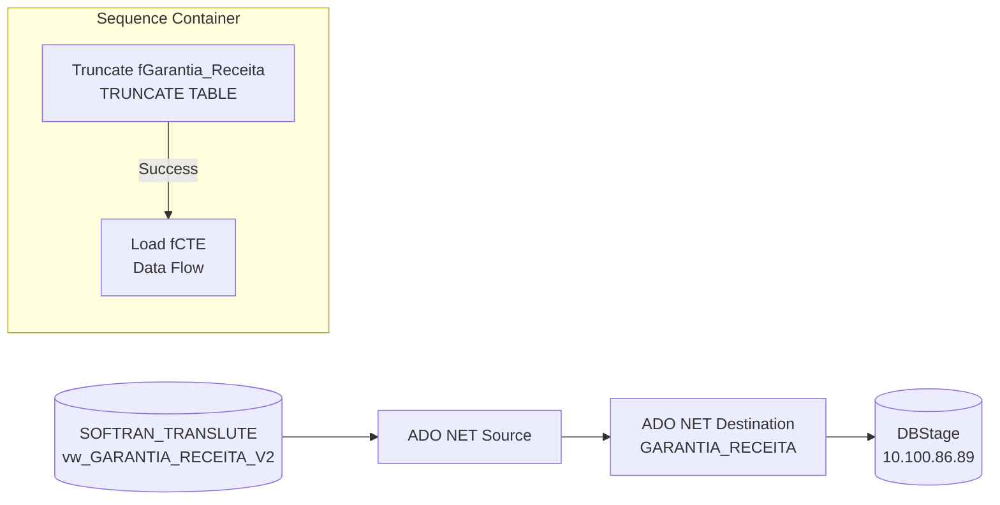

# ETL_Garantia_Receita2 — Documentacao do Package SSIS

## Metadados

| Campo | Valor |
|---|---|
| ObjectName | ETL_Garantia_Receita2 |
| CreationDate | 28/05/2025 14:15:09 |
| CreatorName | GRUPOLCLOG\luiz.costa |
| CreatorComputerName | D2-WV47-DB01 |
| LastModifiedProductVersion | 16.0.5685.0 (SQL Server 2022) |
| VersionBuild | 77 |
| ProtectionLevel | EncryptSensitiveWithUserKey |

## Objetivo

Versao revisada e otimizada do ETL_Garantia_Receita. Carrega a tabela `GARANTIA_RECEITA` no DBStage (10.100.86.89) com dados de CTe extraidos da view `vw_GARANTIA_RECEITA_V2` no SOFTRAN (SOFTRAN_TRANSLUTE). Usa **TRUNCATE TABLE** (mais eficiente que DELETE) antes da carga. O Data Flow usa ADO.NET em vez de OLE DB para leitura da origem. Inclui coluna adicional `CdTitulo` (nao presente no ETL_Garantia_Receita original). Criado por luiz.costa em 28/05/2025, indicando ser uma reescrita mais recente do package original de lucas.vilaca (2024).

## Diagrama ASCII do Fluxo (Control Flow)

```
+-----------------------------------------------+
|           Contêiner da Sequência               |
|                                               |
|  +--------------------------+   Constraint    |
|  | Truncate fGarantia_Receita|  (Success)    |
|  |  (ExecuteSQL Task)        | ----------->  |
|  +--------------------------+               |
|                                               |
|  +------------------+                        |
|  |   Load fCTE      |                        |
|  | (Data Flow Task) |                        |
|  +------------------+                        |
+-----------------------------------------------+
```

## Diagrama Mermaid



## Tabela de Tasks

| # | Nome | Tipo | Container | SQL / Detalhe | ThreadHint |
|---|---|---|---|---|---|
| 1 | Truncate fGarantia_Receita | ExecuteSQL | Contêiner da Sequência | `TRUNCATE TABLE "GARANTIA_RECEITA"` | 0 |
| 2 | Load fCTE | Pipeline (Data Flow) | Contêiner da Sequência | vw_GARANTIA_RECEITA_V2 → GARANTIA_RECEITA | — |

## Tabela de Conexoes

| Nome | Tipo | Servidor | Banco | Usuario |
|---|---|---|---|---|
| 10.100.86.89.DBStage.sqldba | ADO.NET (SqlClient) | 10.100.86.89 | DBStage | sqldba |
| 10.100.86.89.DBStage.sqldba 1 | OLEDB (MSOLEDBSQL) | 10.100.86.89 | DBStage | sqldba |
| 169.57.181.231.SOFTRAN_TRANSLUTE.datalc | ADO.NET (SqlClient) | 169.57.181.231 | SOFTRAN_TRANSLUTE | softran |

> Nota: Este package usa apenas 3 connection managers (vs 8 do ETL_Emissao_CTRB), com MSOLEDBSQL (driver moderno) em vez de SQLOLEDB.1 (legado).

## Variaveis

Nenhuma variavel definida no package.

## Precedence Constraints

| De | Para | Container | Tipo |
|---|---|---|---|
| Truncate fGarantia_Receita | Load fCTE | Contêiner da Sequência | Success (Constraint) |

## Diferencas em relacao ao ETL_Garantia_Receita (v1)

| Aspecto | ETL_Garantia_Receita (v1) | ETL_Garantia_Receita2 (v2) |
|---|---|---|
| Criador | lucas.vilaca (2024) | luiz.costa (2025) |
| Pre-processamento | DELETE from (sem WHERE) | TRUNCATE TABLE (mais rapido) |
| Provider destino | SQLOLEDB.1 (legado) | MSOLEDBSQL (moderno) |
| Tipo de carga (origem) | OLE DB Source | ADO.NET Source |
| Connection managers | 3 (inclui sem Initial Catalog) | 3 (bem definidas) |
| Coluna CdTitulo | Nao existe | Adicionada (wstr,15) |
| Tipo de Documento (destino) | i4 | wstr(40) (mudanca de tipo!) |
| Seguranca | DontSaveSensitive | EncryptSensitiveWithUserKey |
| CommandTimeout destino | 0 | 600s |
