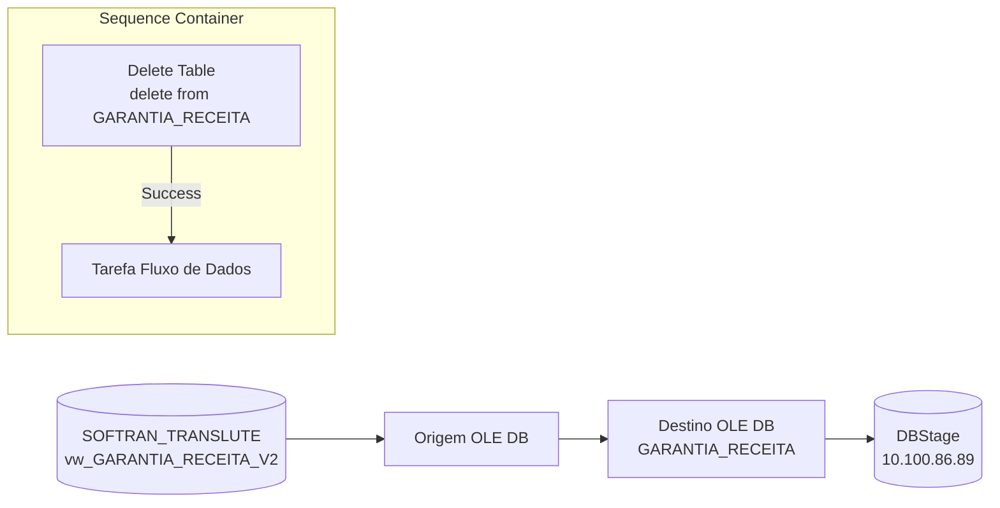

# ETL_Garantia_Receita — Documentacao do Package SSIS

## Metadados

| Campo | Valor |
|---|---|
| ObjectName | ETL_Garantia_Receita |
| CreationDate | 21/06/2024 11:00:02 |
| CreatorName | GRUPOLCLOG\lucas.vilaca |
| CreatorComputerName | TLBARDIR21 |
| LastModifiedProductVersion | 16.0.5685.0 (SQL Server 2022) |
| VersionBuild | 34 |
| ProtectionLevel | 0 (DontSaveSensitive) |

## Objetivo

Carrega a tabela `GARANTIA_RECEITA` no servidor 10.100.86.89 (DBStage) com dados de garantia de receita de fretes (CTe — Conhecimento de Transporte eletronico) extraidos da view `vw_GARANTIA_RECEITA_V2` no sistema SOFTRAN (softran_translute). O processo executa um DELETE completo na tabela de destino antes de cada carga, garantindo recarga total dos dados.

## Diagrama ASCII do Fluxo (Control Flow)

```
+------------------------------------------+
|        Contêiner da Sequência            |
|                                          |
|  +------------------+   Restrição        |
|  |   Delete Table   |  (Success)         |
|  +------------------+ ------------>      |
|                                          |
|  +-----------------------------+         |
|  | Tarefa Fluxo de Dados       |         |
|  +-----------------------------+         |
+------------------------------------------+
```

## Diagrama Mermaid



## Tabela de Tasks

| # | Nome | Tipo | Container | SQL / Detalhe |
|---|---|---|---|---|
| 1 | Delete Table | ExecuteSQL | Contêiner da Sequência | `delete from [dbo].[GARANTIA_RECEITA]` |
| 2 | Tarefa Fluxo de Dados | Pipeline (Data Flow) | Contêiner da Sequência | `vw_GARANTIA_RECEITA_V2` → `GARANTIA_RECEITA` |

## Tabela de Conexoes

| Nome | Tipo | Servidor | Banco | Usuario |
|---|---|---|---|---|
| 10.100.86.89 | ADO.NET (SqlClient) | 10.100.86.89 | — (sem Initial Catalog) | sqldba |
| DBSTAGE | OLEDB (SQLOLEDB.1) | 10.100.86.89 | DBStage | sqldba |
| SOFTRANS - TRANSLUTE | OLEDB (SQLOLEDB.1) | 169.57.181.231 | softran_translute | softran |

> Nota: O nome da connection e "SOFTRANS" (com S), diferente do package ETL_Emissao_CTRB que usa "SOFTRAN" (sem S). Provavel typo.

## Variaveis

Nenhuma variavel definida no package.

## Precedence Constraints

| De | Para | Container | Tipo |
|---|---|---|---|
| Delete Table | Tarefa Fluxo de Dados | Contêiner da Sequência | Success (Restrição) |
