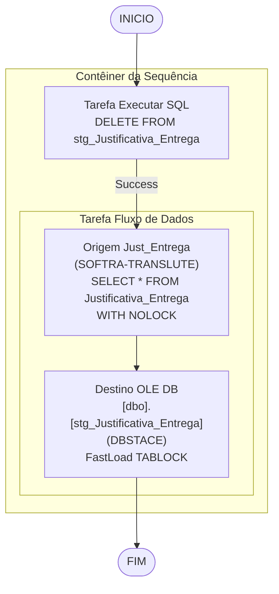

# ETL_Justificativa_Entrega — Documentacao Tecnica

## Metadados do Package

| Atributo | Valor |
|---|---|
| ObjectName | SSIS_stg_JustificativaEntrega |
| Arquivo | ETL_Justificativa_Entrega.dtsx |
| CreationDate | 9/12/2024 8:26:02 AM |
| CreatorName | GRUPOLCLOG\lucas.vilaca |
| CreatorComputerName | TLBARDIR21 |
| LastModifiedProductVersion | 16.0.5685.0 (SQL Server 2022 SSDT) |
| PackageFormatVersion | 8 |
| VersionBuild | 4 |
| LocaleID | 1046 (Portugues Brasil) |

## Objetivo

Carrega o historico de justificativas de entrega (ocorrencias de movimento) do sistema Softran/Translute para a staging area do DBStage. A carga e do tipo full-refresh: DELETE total na tabela de destino seguido de INSERT completo.

## Diagrama ASCII do Fluxo

```
[INICIO]
   |
   v
+----------------------------+
| Contêiner da Sequência     |
|                            |
|  [Tarefa Executar SQL]     |
|   DELETE stg_Justificativa |
|   _Entrega                 |
|         |                  |
|         v (Success)        |
|  [Tarefa Fluxo de Dados]   |
|   Origem Just_Entrega      |
|   (SOFTRA-TRANSLUTE)       |
|       SELECT * FROM        |
|       Justificativa_Entrega|
|         |                  |
|         v                  |
|   Destino OLE DB           |
|   [dbo].[stg_Justificativa |
|   _Entrega] (DBSTACE)      |
+----------------------------+
   |
   v
[FIM]
```

## Diagrama Mermaid



## Tabela de Tasks

| Ordem | Task | Tipo | SQL / Acao | ThreadHint |
|---|---|---|---|---|
| 1 | Tarefa Executar SQL | ExecuteSQL | `delete from [dbo].[stg_Justificativa_Entrega]` | 0 |
| 2 | Tarefa Fluxo de Dados | Pipeline | SELECT * FROM [dbo].[Justificativa_Entrega] with (nolock) → INSERT em stg_Justificativa_Entrega | N/A |

## Tabela de Conexoes

| ID | ObjectName | Tipo | Servidor | Banco | Usuario | Usada em |
|---|---|---|---|---|---|---|
| {3DD4E469-...} | DBSTACE | OLEDB | 10.100.86.89 | DBStage | sqldba | DELETE + Destino |
| {37C9277C-...} | SOFTRA - TRANSLUTE | OLEDB | 169.57.181.231 | softran_translute | softran | Origem |

> Nota: O nome da conexao de origem usa "SOFTRA" (truncado) — o nome completo esperado seria "SOFTRAN".

## Variaveis Declaradas

Nenhuma variavel declarada (`<DTS:Variables />`).
