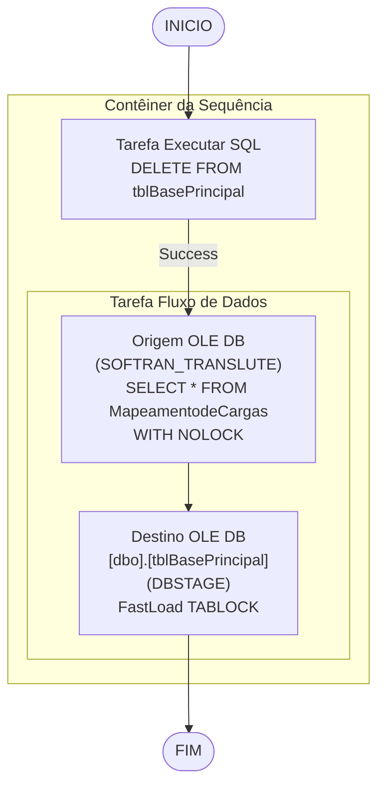

# ETL_Mapeamento_Carga — Documentacao Tecnica

## Metadados do Package

| Atributo | Valor |
|---|---|
| ObjectName | SSIS_stg_MepeamentoCarga |
| Arquivo | ETL_Mapeamento_Carga.dtsx |
| CreationDate | 8/22/2024 10:11:17 AM |
| CreatorName | GRUPOLCLOG\lucas.vilaca |
| CreatorComputerName | TLBARDIR21 |
| LastModifiedProductVersion | 16.0.5685.0 (SQL Server 2022 SSDT) |
| PackageFormatVersion | 8 |
| VersionBuild | 7 |
| LocaleID | 1046 (Portugues Brasil) |

## Objetivo

Carrega o mapeamento de cargas (dados completos dos conhecimentos de transporte) do sistema Softran/Translute para a tabela `tblBasePrincipal` no DBStage. Carga full-refresh: DELETE total + INSERT completo. Inclui dados financeiros, de remetente, destinatario, ocorrencias, romaneio e manifesto.

## Diagrama ASCII do Fluxo

```
[INICIO]
   |
   v
+----------------------------+
| Contêiner da Sequência     |
|                            |
|  [Tarefa Executar SQL]     |
|   DELETE tblBasePrincipal  |
|         |                  |
|         v (Success)        |
|  [Tarefa Fluxo de Dados]   |
|   Origem OLE DB            |
|   (SOFTRAN_TRANSLUTE)      |
|   SELECT * FROM            |
|   MapeamentodeCargas       |
|   WITH (NOLOCK)            |
|         |                  |
|         v                  |
|   Destino OLE DB           |
|   [dbo].[tblBasePrincipal] |
|   (DBSTAGE)                |
+----------------------------+
   |
   v
[FIM]
```

## Diagrama Mermaid



## Tabela de Tasks

| Ordem | Task | Tipo | SQL / Acao | ThreadHint |
|---|---|---|---|---|
| 1 | Tarefa Executar SQL | ExecuteSQL | `DELETE FROM [dbo].[tblBasePrincipal]` | 0 |
| 2 | Tarefa Fluxo de Dados | Pipeline | `SELECT * FROM [dbo].[MapeamentodeCargas] with (nolock)` → INSERT em tblBasePrincipal | N/A |

## Tabela de Conexoes

| ID | ObjectName | Tipo | Servidor | Banco | Usuario | Usada em |
|---|---|---|---|---|---|---|
| {4124CE91-...} | DBSTAGE | OLEDB | 10.100.86.89 | DBStage | sqldba | DELETE + Destino |
| {BFF60185-...} | SOFTRAN_TRANSLUTE | OLEDB | 169.57.181.231 | SOFTRAN_TRANSLUTE | softran | Origem |

## Variaveis Declaradas

Nenhuma variavel declarada (`<DTS:Variables />`).
