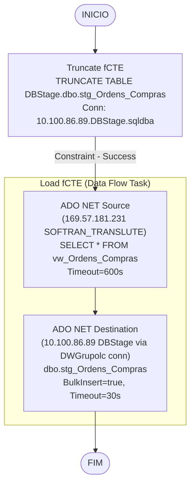

# ETL_Ordem_Compra — Documentacao Tecnica

## Metadados do Package

| Atributo | Valor |
|---|---|
| ObjectName | ETL_Ordem_Compra |
| Arquivo | ETL_Ordem_Compra.dtsx |
| CreationDate | 5/28/2025 2:15:09 PM |
| CreatorName | GRUPOLCLOG\luiz.costa |
| CreatorComputerName | D2-WV47-DB01 |
| LastModifiedProductVersion | 16.0.5685.0 (SQL Server 2022 SSDT) |
| PackageFormatVersion | 8 |
| VersionBuild | 45 |
| LocaleID | 1046 (Portugues Brasil) |

## Objetivo

Carrega ordens de compra da view `vw_Ordens_Compras` no Softran/Translute para a tabela `stg_Ordens_Compras` no DBStage. Carga full-refresh: TRUNCATE TABLE + INSERT via ADO.NET. O source usa SQL customizado com timeout de 600 segundos.

## Diagrama ASCII do Fluxo

```
[INICIO]
   |
   v
[Truncate fCTE]
 TRUNCATE TABLE
 [DBStage].[dbo].[stg_Ordens_Compras]
   |
   v (Success)
[Load fCTE]
   |
   +-- ADO NET Source
   |   169.57.181.231.SOFTRAN_TRANSLUTE.datalc
   |   SELECT * FROM "dbo"."vw_Ordens_Compras"
   |   CommandTimeout=600s
   |
   +---> ADO NET Destination
         10.100.86.89.DWGrupolc.sqldba
         "dbo"."stg_Ordens_Compras"
         UseBulkInsert=true, CommandTimeout=30s
   |
   v
[FIM]
```

## Diagrama Mermaid



## Tabela de Tasks

| Ordem | Task | Tipo | SQL / Acao | ThreadHint |
|---|---|---|---|---|
| 1 | Truncate fCTE | ExecuteSQL | `TRUNCATE TABLE [DBStage].[dbo].[stg_Ordens_Compras]` | 0 |
| 2 | Load fCTE | Pipeline | `SELECT * FROM "dbo"."vw_Ordens_Compras"` (ADO.NET Source, timeout=600s) → INSERT stg_Ordens_Compras (ADO.NET Dest, timeout=30s) | N/A |

## Tabela de Conexoes

| ID | ObjectName | Tipo | Servidor | Banco | Usuario | Usada em |
|---|---|---|---|---|---|---|
| {45870B5A-...} | 10.100.86.89.DBStage.sqldba | OLEDB (SQLNCLI11.1) | 10.100.86.89 | DBStage | sqldba | TRUNCATE |
| {E126819E-...} | 10.100.86.89.DWGrupolc.sqldba | ADO.NET (SqlClient) | 10.100.86.89 | DBStage (*) | sqldba | Destino ADO.NET |
| {6BB7A8D8-...} | 10.100.86.89.DWGrupolc.sqldba1 | OLEDB (SQLNCLI11.1) | 10.100.86.89 | DWGrupolc | sqldba | Reserva |
| {83B4BE60-...} | 169.57.181.231.SOFTRAN_TRANSLUTE.datalc | ADO.NET (SqlClient) | 169.57.181.231 | SOFTRAN_TRANSLUTE | softran | Origem ADO.NET |

(*) Atencao: o connection string da conexao {E126819E} tem ObjectName "DWGrupolc" mas aponta para `Initial Catalog=DBStage` — ver issues.

## Variaveis Declaradas

Nenhuma variavel declarada (`<DTS:Variables />`).
