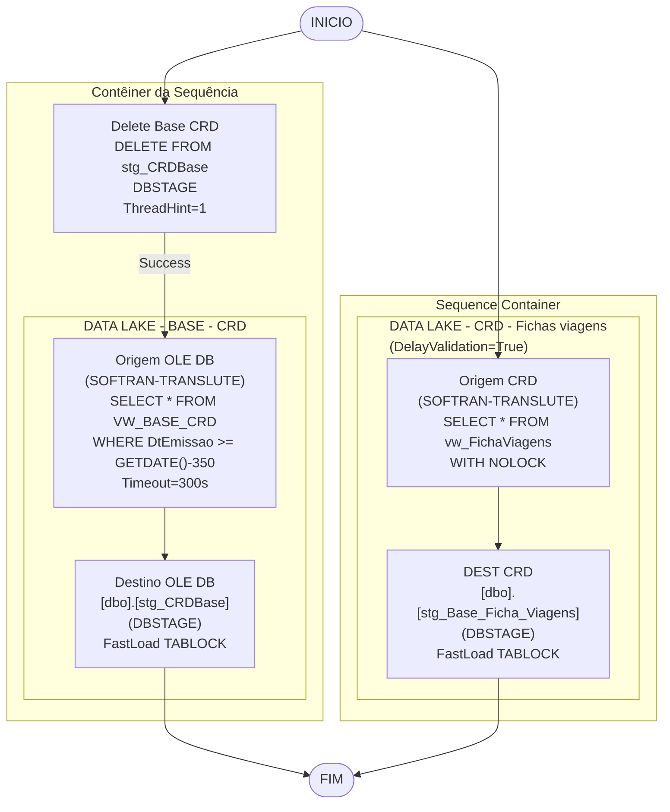

# ETL_Painel_CRD — Documentacao Tecnica

## Metadados do Package

| Atributo | Valor |
|---|---|
| ObjectName | SSIS_stg_Painel_CRD |
| Arquivo | ETL_Painel_CRD.dtsx |
| CreationDate | 4/4/2024 9:00:31 AM |
| CreatorName | GRUPOLCLOG\lucas.vilaca |
| CreatorComputerName | TLBARDIR21 |
| LastModifiedProductVersion | 16.0.5685.0 (SQL Server 2022 SSDT) |
| PackageFormatVersion | 8 |
| VersionBuild | 156 |
| LocaleID | 1046 (Portugues Brasil) |

## Objetivo

Package de maior complexidade. Executa duas cargas independentes em paralelo (dois Sequence Containers):
1. **Contêiner da Sequência** — Carrega a base completa CRD (conhecimentos de transporte com janela de 350 dias) da view `VW_BASE_CRD` para `stg_CRDBase`. CommandTimeout=300s.
2. **Sequence Container** — Carrega fichas de viagens da view `vw_FichaViagens` para `stg_Base_Ficha_Viagens`.

## Diagrama ASCII do Fluxo

```
[INICIO]
   |
   +------ Contêiner da Sequência ------+------ Sequence Container ------+
   |                                    |                                 |
   v                                    v                                 v
[Delete Base CRD]               [DATA LAKE - CRD -               (sem DELETE)
DELETE stg_CRDBase               Fichas viagens]
ThreadHint=1                     ...
   |
   v (Success)
[DATA LAKE - BASE - CRD]
   Origem OLE DB (SOFTRAN-TRANSLUTE)
   SELECT * FROM VW_BASE_CRD
   WHERE DtEmissao >= GETDATE()-350
   CommandTimeout=300s
   |
   v
   Destino OLE DB (DBSTAGE)
   [dbo].[stg_CRDBase]
   FastLoad TABLOCK
   |
[FIM Container 1]               [FIM Container 2]
```

## Diagrama Mermaid



## Tabela de Tasks

| Ordem | Task | Container | Tipo | SQL / Acao | ThreadHint |
|---|---|---|---|---|---|
| 1 | Delete Base CRD | Contêiner da Sequência | ExecuteSQL | `DELETE FROM [dbo].[stg_CRDBase]` | 1 |
| 2 | DATA LAKE - BASE - CRD | Contêiner da Sequência | Pipeline | SELECT VW_BASE_CRD (350 dias) → stg_CRDBase, timeout=300s | N/A |
| 3 | DATA LAKE - CRD - Fichas viagens | Sequence Container | Pipeline (DelayValidation) | SELECT vw_FichaViagens → stg_Base_Ficha_Viagens | N/A |

## Tabela de Conexoes

| ID | ObjectName | Tipo | Servidor | Banco | Usuario | Usada em |
|---|---|---|---|---|---|---|
| {D9AD8631-...} | DBSTAGE | OLEDB | 10.100.86.89 | DBStage | sqldba | DELETE + Destino CRDBase + Destino Fichas |
| {3D09F7C6-...} | DW_GRUPOLC | OLEDB | 10.100.86.89 | DWGrupolc | sqldba | Nao utilizada diretamente |
| {DBFB8F87-...} | SOFTRAN - TRANSLUTE | OLEDB | 169.57.181.231 | softran_translute | softran | Origem VW_BASE_CRD + Origem vw_FichaViagens |

## Variaveis Declaradas

Nenhuma variavel declarada (`<DTS:Variables />`).
