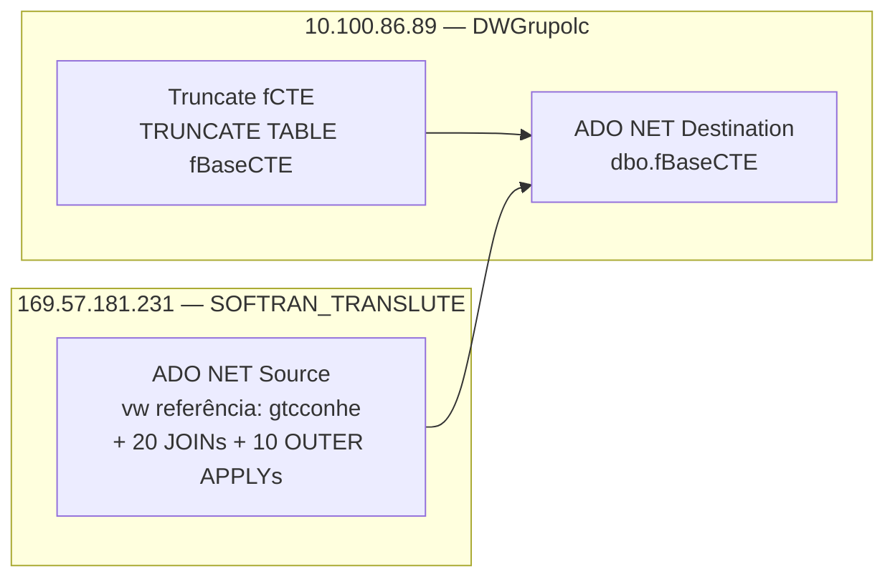

# ETL_Painel_CTE — Documentação do Package SSIS

## Metadados

| Campo                        | Valor                                      |
|------------------------------|--------------------------------------------|
| ObjectName                   | ETL_Painel_CTE                             |
| CreationDate                 | 5/28/2025 2:15:09 PM                       |
| CreatorName                  | GRUPOLCLOG\luiz.costa                      |
| CreatorComputerName          | D2-WV47-DB01                               |
| LastModifiedProductVersion   | 16.0.5685.0 (SQL Server 2022)              |
| VersionBuild                 | 63                                         |
| VersionGUID                  | {1305B03B-C3B7-4020-AA93-AAAA2C86000B}     |
| DTSID                        | {C5BD10C9-707E-48B3-A9A2-1A599914CDE8}     |
| ProtectionLevel              | 0 (sem criptografia)                       |
| PackageFormatVersion         | 8                                          |

## Objetivo

Carga completa (full load) da tabela `dbo.fBaseCTE` no servidor DW (10.100.86.89 / DWGrupolc).

Os dados são extraídos da view `gtcconhe` (base de Conhecimentos de Transporte) no servidor de produção SOFTRAN (169.57.181.231 / SOFTRAN_TRANSLUTE), com consulta SQL inline que une mais de 20 tabelas e sub-consultas OUTER APPLY para enriquecer cada CT-e com informações de notas fiscais, ocorrências, romaneios, manifestos, EDI e previsão de entrega.

O pacote realiza:
1. TRUNCATE da tabela destino (`Truncate fCTE`).
2. Carga do resultado da query diretamente via ADO.NET Bulk Copy (`Load fCTE`).

## Diagrama ASCII — Fluxo de Controle

```
+------------------+
|  Truncate fCTE   |  Execute SQL Task — TRUNCATE TABLE "fBaseCTE"
+------------------+
         |
         | (Success)
         v
+------------------+
|   Load fCTE      |  Data Flow Task
+------------------+
   ADO NET Source (169.57.181.231 — gtcconhe + joins)
         |
         v
   ADO NET Destination (10.100.86.89 — dbo.fBaseCTE)
```

## Diagrama Mermaid — Linhagem de Dados



## Tabela de Tasks

| # | Nome           | Tipo               | Conexão Destino                    | SQL / Ação                                | ThreadHint |
|---|----------------|--------------------|------------------------------------|-------------------------------------------|------------|
| 1 | Truncate fCTE  | Execute SQL Task   | 10.100.86.89.DWGrupolc (OLEDB)     | `TRUNCATE TABLE "fBaseCTE"`               | 0          |
| 2 | Load fCTE      | Data Flow Task     | Origem: SOFTRAN / Destino: DWGrupolc | SELECT inline de ~240 linhas              | —          |

## Tabela de Conexões

| Nome                                    | Tipo    | Servidor           | Banco               | Usuário  | Observação                   |
|-----------------------------------------|---------|--------------------|---------------------|----------|------------------------------|
| 10.100.86.89.DWGrupolc.sqldba           | ADO.NET | 10.100.86.89       | DWGrupolc           | sqldba   | Destino — escrita fBaseCTE   |
| 10.100.86.89.DWGrupolc.sqldba1          | OLEDB   | 10.100.86.89       | DWGrupolc           | sqldba   | Destino — TRUNCATE (OLEDB)   |
| 169.57.181.231.SOFTRAN_TRANSLUTE.datalc | ADO.NET | 169.57.181.231     | SOFTRAN_TRANSLUTE   | softran  | Origem — leitura gtcconhe    |

## Variáveis

Nenhuma variável declarada (`<DTS:Variables />`).

## Precedence Constraints

| De            | Para      | Condição |
|---------------|-----------|----------|
| Truncate fCTE | Load fCTE | Success  |
