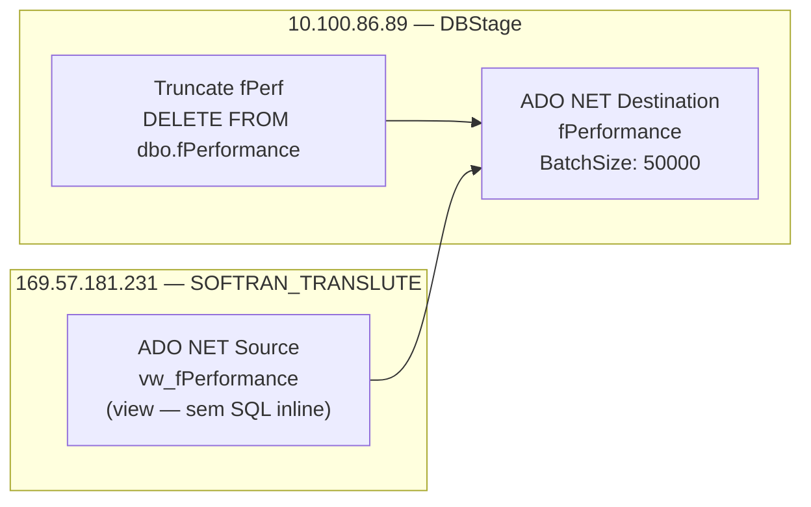

# ETL_Performance_V2 — Documentação do Package SSIS

## Metadados

| Campo                        | Valor                                      |
|------------------------------|--------------------------------------------|
| ObjectName                   | ETL_Performance                            |
| Arquivo Físico               | ETL_Performance_V2.dtsx                    |
| CreationDate                 | 5/28/2025 2:15:09 PM                       |
| CreatorName                  | GRUPOLCLOG\luiz.costa                      |
| CreatorComputerName          | D2-WV47-DB01                               |
| LastModifiedProductVersion   | 16.0.5685.0 (SQL Server 2022)              |
| VersionBuild                 | 95                                         |
| VersionGUID                  | {29B01A45-1FCA-4CCA-BCC7-C665456A0249}     |
| DTSID                        | {F0A08D3A-6D3C-4FBA-9906-0DAB9C5A8FDE}    |
| ProtectionLevel              | 0 (sem criptografia — senhas encriptadas separadamente) |
| PackageFormatVersion         | 8                                          |

## Objetivo

Carga de performance/SLA de CT-es na tabela `dbo.fPerformance` no banco `DBStage` (10.100.86.89).

Os dados são extraídos da view `dbo.vw_fPerformance` no servidor SOFTRAN (169.57.181.231 / SOFTRAN_TRANSLUTE). O package usa uma variável `User::StartDate` que pode ser configurada via task `GetDate 1M` (atualmente **desabilitada**).

O package realiza:
1. (Opcional/Disabled) `GetDate 1M` — calcula primeiro dia do mês anterior.
2. `Truncate fPerf` — `DELETE FROM dbo.fPerformance` (sem parâmetro de filtro efetivo).
3. `Load fPerf` — Data Flow que carrega de `vw_fPerformance` para `fPerformance`.

## Diagrama ASCII — Fluxo de Controle

```
+----------------+
| GetDate 1M     |  Execute SQL Task — DISABLED
| (Desabilitado) |  SELECT DATEADD(month, ...) → User::StartDate
+----------------+
         |
         | (Success — mas desabilitado, não executa)
         v
+------------------+
|  Truncate fPerf  |  Execute SQL Task
|                  |  DELETE FROM dbo.fPerformance
+------------------+
         |
         | (Success)
         v
+------------------+
|   Load fPerf     |  Data Flow Task
+------------------+
   ADO NET Source (169.57.181.231 — dbo.vw_fPerformance)
         |
         v
   ADO NET Destination (10.100.86.89/DBStage — fPerformance)
```

## Diagrama Mermaid — Linhagem de Dados



## Tabela de Tasks

| # | Nome          | Tipo              | Habilitado | Conexão                              | SQL / Ação                                                   | ThreadHint |
|---|---------------|-------------------|------------|--------------------------------------|--------------------------------------------------------------|------------|
| 1 | GetDate 1M    | Execute SQL Task  | **NÃO**    | 10.100.86.89.DBStage.sqldba (ADO.NET) | `SELECT DATEADD(month, DATEDIFF(month, 0, GETDATE()) - 1, 0) AS StartDate` → User::StartDate | 0 |
| 2 | Truncate fPerf | Execute SQL Task | Sim        | 10.100.86.89.DBStage.sqldba (ADO.NET) | `DELETE FROM dbo.fPerformance` (parâmetro User::StartDate vinculado mas sem WHERE) | 0 |
| 3 | Load fPerf    | Data Flow Task    | Sim        | Origem: SOFTRAN / Destino: DBStage   | Leitura de vw_fPerformance → fPerformance                   | —          |

## Tabela de Conexões

| Nome                                     | Tipo    | Servidor       | Banco              | Usuário  | Observação                          |
|------------------------------------------|---------|----------------|--------------------|----------|-------------------------------------|
| 10.100.86.89.DBStage.sqldba              | ADO.NET | 10.100.86.89   | DBStage            | sqldba   | Destino — GetDate + Delete          |
| 10.100.86.89.DBStage.sqldba 1            | ADO.NET | 10.100.86.89   | DBStage            | sqldba   | Destino — escrita fPerformance      |
| 10.100.86.89.DBStage.sqldba1             | OLEDB   | 10.100.86.89   | DBStage            | sqldba   | OLEDB (SQLNCLI11.1) — não usado ativamente |
| 10.100.86.89.DWGrupolc.datalc            | ADO.NET | 10.100.86.89   | DWGrupolc          | sqldba   | Declarada, não utilizada nas tasks  |
| 10.100.86.89.DWGrupolc.sqldba1           | OLEDB   | 10.100.86.89   | DWGrupolc          | sqldba   | Declarada, não utilizada nas tasks  |
| 169.57.181.231.SOFTRAN_TRANSLUTE.datalc  | ADO.NET | 169.57.181.231 | SOFTRAN_TRANSLUTE  | softran  | Origem — leitura vw_fPerformance    |
| 169.57.181.231.SOFTRAN_TRANSLUTE.softran | OLEDB   | 169.57.181.231 | SOFTRAN_TRANSLUTE  | softran  | OLEDB (SQLNCLI11.1) — não usado ativamente |

## Variáveis

| Nome      | Namespace | Tipo     | Valor Padrão | Uso                                                    |
|-----------|-----------|----------|--------------|--------------------------------------------------------|
| StartDate | User      | DateTime | 1/1/2025     | Vinculada ao output do GetDate 1M (desabilitado) e ao parâmetro do DELETE (sem WHERE) |

## Precedence Constraints (dentro do Sequence Container)

| De             | Para           | Condição |
|----------------|----------------|----------|
| GetDate 1M     | Truncate fPerf | Success  |
| Truncate fPerf | Load fPerf     | Success  |

## Estrutura do Sequence Container

Todas as tasks estão dentro de um `Sequence Container` chamado "Sequence Container".

```
Package
  └── Sequence Container
        ├── GetDate 1M    (DISABLED)
        ├── Truncate fPerf
        └── Load fPerf
```
