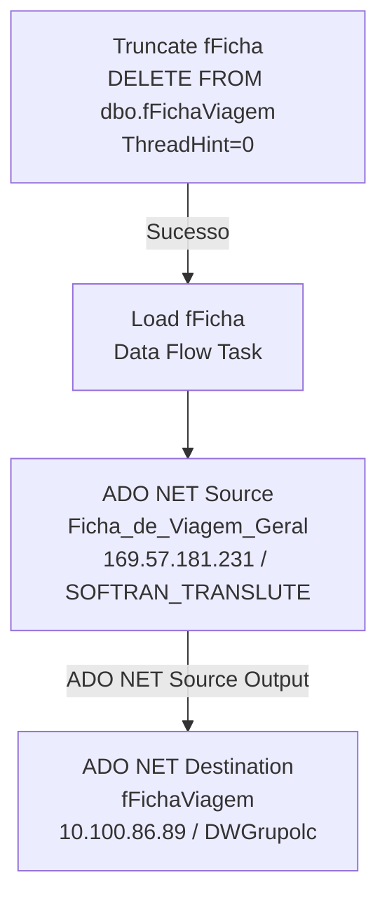

# ETL_Romaneios1 — Documentação do Package SSIS

## Metadados

| Propriedade              | Valor                                      |
|--------------------------|--------------------------------------------|
| Package Name             | ETL_Romaneios                              |
| Arquivo                  | ETL_Romaneios1.dtsx                        |
| Data de Criação          | 28/05/2025 14:15:09                        |
| Autor                    | GRUPOLCLOG\luiz.costa                      |
| Máquina de Criação       | D2-WV47-DB01                               |
| Versão SSIS (Product)    | 16.0.5685.0 (SQL Server 2022)              |
| PackageFormatVersion     | 8                                          |
| VersionBuild             | 75                                         |
| DTSID                    | {3CE0A483-7E9F-44F9-AED4-177DF43AAD35}     |

## Objetivo

Carrega a tabela `fFichaViagem` no DW (DWGrupolc) com dados de fichas de viagem originados da view `dbo.Ficha_de_Viagem_Geral` do sistema SOFTRAN_TRANSLUTE. O fluxo executa primeiro um DELETE completo da tabela destino e em seguida carrega todos os registros filtrados a partir da variável `StartDate` (padrão: 01/01/2025).

> **Observação:** Apesar do parâmetro `StartDate` estar vinculado no ParameterBinding da task SQL, o SQL de DELETE não usa WHERE — o DELETE é incondicional. O filtro de data na origem está na view de origem e NÃO é aplicado via variável parametrizada na task de limpeza.

---

## Diagrama ASCII do Fluxo

```
+---------------------+        +-------------------+
| Truncate fFicha     |  --->  | Load fFicha       |
| (ExecuteSQL)        |        | (Data Flow Task)  |
| DELETE FROM         |        |                   |
| dbo.fFichaViagem    |        | ADO NET Source    |
+---------------------+        | (Ficha_de_Viagem  |
                                | _Geral)           |
                                |       |           |
                                |       v           |
                                | ADO NET Dest.     |
                                | (fFichaViagem)    |
                                +-------------------+
```

---

## Diagrama Mermaid



---

## Tabela de Tasks

| Ordem | Task              | Tipo           | SQL / Ação                                    | ThreadHint |
|-------|-------------------|----------------|-----------------------------------------------|------------|
| 1     | Truncate fFicha   | ExecuteSQL     | `DELETE FROM dbo.fFichaViagem`                | 0          |
| 2     | Load fFicha       | Pipeline       | Leitura de `dbo.Ficha_de_Viagem_Geral`, carga em `fFichaViagem` | N/A |

---

## Tabela de Conexões

| ID (ObjectName)                               | Tipo         | Servidor           | Banco             | Usuário   | Usada em                              |
|-----------------------------------------------|--------------|--------------------|-------------------|-----------|---------------------------------------|
| 10.100.86.89.DWGrupolc.datalc                 | ADO.NET      | 10.100.86.89       | DWGrupolc         | sqldba    | ADO NET Destination (Load fFicha)     |
| 10.100.86.89.DWGrupolc.sqldba1                | OLEDB        | 10.100.86.89       | DWGrupolc         | sqldba    | Truncate fFicha (ExecuteSQL)          |
| 169.57.181.231.SOFTRAN_TRANSLUTE.datalc       | ADO.NET      | 169.57.181.231     | SOFTRAN_TRANSLUTE | softran   | ADO NET Source (Load fFicha)          |

---

## Variáveis

| Nome       | Namespace | Tipo       | Valor Padrão  | Usada em                                |
|------------|-----------|------------|---------------|-----------------------------------------|
| StartDate  | User      | DateTime (7) | 01/01/2025  | ParameterBinding em Truncate fFicha (não aplicado no SQL atual) |
