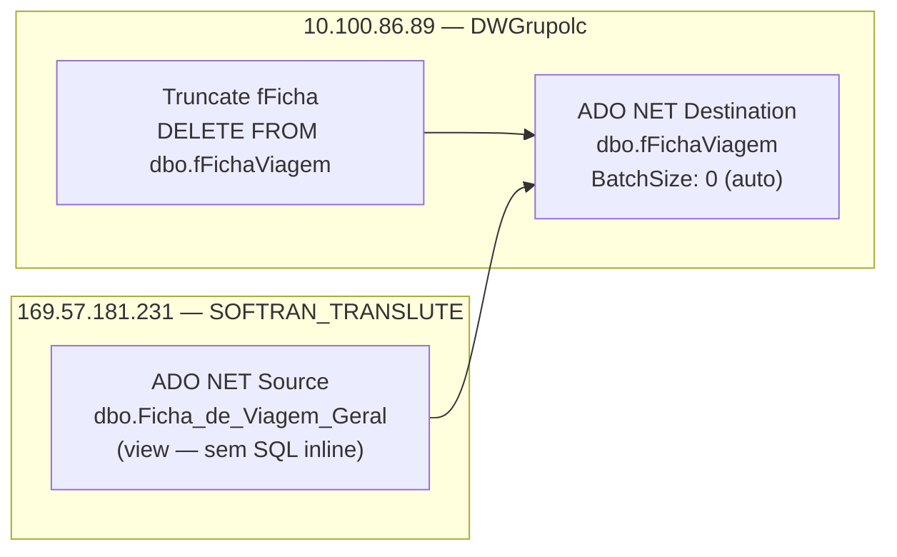

# ETL_Romaneios — Documentação do Package SSIS

## Metadados

| Campo                        | Valor                                      |
|------------------------------|--------------------------------------------|
| ObjectName                   | ETL_Romaneios                              |
| Arquivo Físico               | ETL_Romaneios.dtsx                         |
| CreationDate                 | 5/28/2025 2:15:09 PM                       |
| CreatorName                  | GRUPOLCLOG\luiz.costa                      |
| CreatorComputerName          | D2-WV47-DB01                               |
| LastModifiedProductVersion   | 16.0.5685.0 (SQL Server 2022)              |
| VersionBuild                 | 75                                         |
| VersionGUID                  | {51387739-38BF-4C4B-92EE-BD4AA95FD263}     |
| DTSID                        | {3CE0A483-7E9F-44F9-AED4-177DF43AAD35}     |
| ProtectionLevel              | 0 (senhas criptografadas individualmente)  |
| PackageFormatVersion         | 8                                          |

## Objetivo

Carga da tabela `dbo.fFichaViagem` no banco `DWGrupolc` (10.100.86.89) com dados de Fichas de Viagem e Romaneios.

Os dados são extraídos da view `dbo.Ficha_de_Viagem_Geral` no servidor SOFTRAN (169.57.181.231 / SOFTRAN_TRANSLUTE).

O package realiza:
1. `Truncate fFicha` — `DELETE FROM dbo.fFichaViagem` (com parâmetro `User::StartDate` sem WHERE efetivo).
2. `Load fFicha` — Data Flow que carrega de `Ficha_de_Viagem_Geral` para `fFichaViagem`.

## Diagrama ASCII — Fluxo de Controle

```
+-------------------+
|  Truncate fFicha  |  Execute SQL Task
|                   |  DELETE FROM dbo.fFichaViagem
+-------------------+
         |
         | (Success)
         v
+-------------------+
|   Load fFicha     |  Data Flow Task
+-------------------+
   ADO NET Source (169.57.181.231 — dbo.Ficha_de_Viagem_Geral)
         |
         v
   ADO NET Destination (10.100.86.89/DWGrupolc — dbo.fFichaViagem)
```

## Diagrama Mermaid — Linhagem de Dados



## Tabela de Tasks

| # | Nome           | Tipo               | Conexão                              | SQL / Ação                             | ThreadHint |
|---|----------------|--------------------|--------------------------------------|----------------------------------------|------------|
| 1 | Truncate fFicha | Execute SQL Task  | 10.100.86.89.DWGrupolc.sqldba1 (OLEDB) | `DELETE FROM dbo.fFichaViagem`        | 0          |
| 2 | Load fFicha    | Data Flow Task     | Origem: SOFTRAN / Destino: DWGrupolc | Leitura de Ficha_de_Viagem_Geral → fFichaViagem | —  |

## Tabela de Conexões

| Nome                                    | Tipo    | Servidor       | Banco             | Usuário  | Observação                       |
|-----------------------------------------|---------|----------------|-------------------|----------|----------------------------------|
| 10.100.86.89.DWGrupolc.datalc           | ADO.NET | 10.100.86.89   | DWGrupolc         | sqldba   | Destino — escrita fFichaViagem   |
| 10.100.86.89.DWGrupolc.sqldba1          | OLEDB   | 10.100.86.89   | DWGrupolc         | sqldba   | OLEDB (SQLNCLI11.1) — DELETE     |
| 169.57.181.231.SOFTRAN_TRANSLUTE.datalc | ADO.NET | 169.57.181.231 | SOFTRAN_TRANSLUTE | softran  | Origem — leitura view Ficha      |

## Variáveis

| Nome      | Namespace | Tipo     | Valor Padrão | Observação                                               |
|-----------|-----------|----------|--------------|----------------------------------------------------------|
| StartDate | User      | DateTime | 1/1/2025     | Vinculada ao DELETE mas sem WHERE — não tem efeito prático |

## Precedence Constraints

| De             | Para       | Condição |
|----------------|------------|----------|
| Truncate fFicha | Load fFicha | Success |
