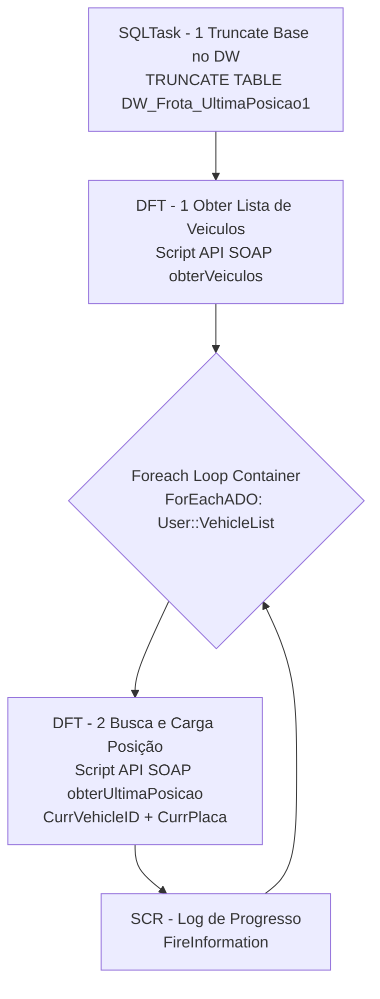

# ETL_Sascar — Documentação do Package SSIS

## Metadados

| Propriedade              | Valor                                      |
|--------------------------|--------------------------------------------|
| Package Name             | ETL_Sascar                                 |
| Arquivo                  | ETL_Sascar.dtsx                            |
| Data de Criação          | 01/07/2025 10:12:18                        |
| Autor                    | GRUPOLCLOG\luiz.costa                      |
| Máquina de Criação       | D2-WV47-DB01                               |
| Versão SSIS (Product)    | 16.0.5685.0 (SQL Server 2022)              |
| PackageFormatVersion     | 8                                          |
| VersionBuild             | 75                                         |
| DTSID                    | {244A4A88-3F9D-4429-B884-7F9D64BC3364}     |

## Objetivo

Integra dados de rastreamento de frota da API SOAP da Sascar (`sasintegra.sascar.com.br`) com o Data Warehouse (DWGrupolc). O package:
1. Trunca a tabela `DW_Frota_UltimaPosicao1`
2. Obtém a lista completa de veículos via chamada SOAP (até 3.000 veículos)
3. Para cada veículo, consulta a última posição GPS individualmente via API Sascar
4. Carrega os dados de posição (odômetro, ignição, velocidade, coordenadas, motorista) na tabela DW

---

## Diagrama ASCII do Fluxo

```
+-------------------------------+
| SQLTask - 1 Truncate Base DW |
| TRUNCATE TABLE                |
| DW_Frota_UltimaPosicao1       |
+-------------------------------+
           |
           v
+-------------------------------+
| DFT - 1 Obter Lista Veiculos |
| Script (API SOAP obterVeiculos)|
| --> Recordset (VehicleList)   |
+-------------------------------+
           |
           v
+-------------------------------+
| Foreach Loop Container        |
| (ForEachADO: VehicleList)     |
|  Vars: CurrentVehicleID,      |
|        CurrentPlaca           |
|  +---------------------------+|
|  | DFT-2 Busca Carga Posição||
|  | Script API SOAP (posição) ||
|  | --> ADO NET Dest.         ||
|  +---------------------------+|
|  +---------------------------+|
|  | SCR - Log de Progresso    ||
|  | (Script Task - FireInfo)  ||
|  +---------------------------+|
+-------------------------------+
```

---

## Diagrama Mermaid



---

## Tabela de Tasks

| Ordem | Task                              | Tipo         | SQL / Ação                                                       | ThreadHint |
|-------|-----------------------------------|--------------|------------------------------------------------------------------|------------|
| 1     | SQLTask - 1 Truncate Base no DW   | ExecuteSQL   | `TRUNCATE TABLE DW_Frota_UltimaPosicao1`                        | 0          |
| 2     | DFT - 1 Obter Lista de Veiculos   | Pipeline     | Chama API SOAP `obterVeiculos` (qty=3000), carrega `VehicleList` | N/A        |
| 3     | Foreach Loop Container            | ForEachLoop  | Itera sobre `User::VehicleList` (ForEachADOEnumerator)           | N/A        |
| 3.1   | DFT - 2 Busca e Carga Posição     | Pipeline     | Chama API SOAP por placa/ID, insere em `DW_Frota_UltimaPosicao1` | N/A       |
| 3.2   | SCR - Log de Progresso            | Script Task  | `FireInformation` com ID do veículo e placa atual               | 0          |

---

## Tabela de Conexões

| ID (ObjectName)              | Tipo         | Servidor / URL                                   | Banco/Recurso          | Usada em                         |
|------------------------------|--------------|--------------------------------------------------|------------------------|----------------------------------|
| 10.100.86.89.DWGrupolc.sqldba | ADO.NET     | 10.100.86.89                                     | DWGrupolc              | ADO NET Destination (DFT-2)      |
| CCM_JornadaMotoristaCache    | CACHE        | In-memory                                        | —                       | Definida mas não usada no fluxo  |
| Excel Connection Manager     | EXCEL        | C:\Users\luiz.costa\Desktop\Output_Sascar1.xlsx  | Output_Sascar1.xlsx    | Definida mas não usada no fluxo  |
| HTTP Connection Manager      | HTTP         | https://sasintegra.sascar.com.br/...?wsdl        | SOAP WebService        | Definida mas não usada diretamente (Script usa HttpWebRequest próprio) |

---

## Variáveis

| Nome              | Namespace | Tipo          | Valor Padrão | Usada em                                       |
|-------------------|-----------|---------------|--------------|------------------------------------------------|
| CurrentPlaca      | User      | String (8)    | "1"          | Foreach mapping (index 1), Script DFT-2 e SCR Log |
| CurrentVehicleID  | User      | Int32 (3)     | 0            | Foreach mapping (index 0), Script DFT-2 e SCR Log |
| VehicleList       | User      | Object (13)   | (empty)      | Saída do DFT-1 (Recordset Destination), entrada do Foreach Loop |

---

## Credenciais API Sascar (embutidas no script)

| Propriedade | Valor               |
|-------------|---------------------|
| Usuário     | INTERNATRANSLUTE    |
| Senha       | sascar              |
| URL         | https://sasintegra.sascar.com.br/SasIntegra/SasIntegraWSService |
| Protocolo   | TLS 1.2             |
| Formato     | SOAP 1.1            |
