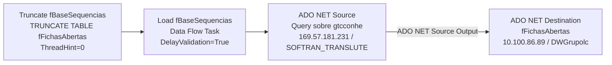

# ETL_Sequencias — Documentação do Package SSIS

## Metadados

| Propriedade              | Valor                                      |
|--------------------------|--------------------------------------------|
| Package Name             | ETL_Sequencias                             |
| Arquivo                  | ETL_Sequencias.dtsx                        |
| Data de Criação          | 26/08/2025 12:03:47                        |
| Autor                    | GRUPOLCLOG\luiz.costa                      |
| Máquina de Criação       | D2-WV47-DB01                               |
| Versão SSIS (Product)    | 16.0.5685.0 (SQL Server 2022)              |
| PackageFormatVersion     | 8                                          |
| VersionBuild             | 16                                         |
| DTSID                    | {A3026DA6-3C82-4B46-A2A1-4AA283F80E3C}     |
| DelayValidation          | True (na task Load fBaseSequencias)        |

## Objetivo

Carrega a tabela `fFichasAbertas` no DW (DWGrupolc) com dados detalhados de CTes (conhecimentos de transporte eletrônico) em aberto, originados da view/query complexa sobre a base SOFTRAN_TRANSLUTE. A query realiza múltiplas junções com dados de romaneio, manifesto, EDI, ocorrências, notas fiscais, fatura e previsão de entrega.

O fluxo é: TRUNCATE `fFichasAbertas` → carregar dados da query complexa sobre `gtcconhe` (principais tabelas SOFTRAN).

---

## Diagrama ASCII do Fluxo

```
+-------------------------------+     +-------------------------------+
| Truncate fBaseSequencias      | --> | Load fBaseSequencias          |
| (ExecuteSQL)                  |     | (Data Flow Task)              |
| TRUNCATE TABLE "fFichasAbertas"|    |                               |
+-------------------------------+     | ADO NET Source                |
                                      | (query complexa sobre         |
                                      | gtcconhe + 20+ tabelas SOFTRAN)|
                                      |           |                   |
                                      |           v                   |
                                      | ADO NET Destination           |
                                      | (fFichasAbertas)              |
                                      +-------------------------------+
```

---

## Diagrama Mermaid



---

## Tabela de Tasks

| Ordem | Task                      | Tipo        | SQL / Ação                                         | ThreadHint |
|-------|---------------------------|-------------|----------------------------------------------------|------------|
| 1     | Truncate fBaseSequencias  | ExecuteSQL  | `TRUNCATE TABLE "fFichasAbertas"`                  | 0          |
| 2     | Load fBaseSequencias      | Pipeline    | Query complexa sobre gtcconhe + 20 tabelas SOFTRAN, carga em `fFichasAbertas` | N/A |

---

## Tabela de Conexões

| ID (ObjectName)                         | Tipo     | Servidor         | Banco             | Usuário | Usada em                               |
|-----------------------------------------|----------|------------------|-------------------|---------|----------------------------------------|
| 10.100.86.89.DWGrupolc.sqldba           | ADO.NET  | 10.100.86.89     | DWGrupolc         | sqldba  | ADO NET Destination (Load fBaseSequencias) |
| 10.100.86.89.DWGrupolc.sqldba1          | OLEDB    | 10.100.86.89     | DWGrupolc         | sqldba  | Truncate fBaseSequencias (ExecuteSQL)  |
| 169.57.181.231.SOFTRAN_TRANSLUTE.datalc | ADO.NET  | 169.57.181.231   | SOFTRAN_TRANSLUTE | datalc  | ADO NET Source (Load fBaseSequencias)  |

---

## Variáveis

Nenhuma variável de usuário definida (`<DTS:Variables />`).
