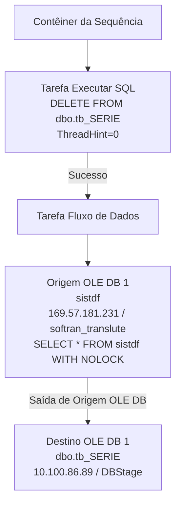

# ETL_TpDoctoFiscal — Documentação do Package SSIS

## Metadados

| Propriedade              | Valor                                      |
|--------------------------|--------------------------------------------|
| Package Name             | SSIS_stg_TpDoctoFiscal                     |
| Arquivo                  | ETL_TpDoctoFiscal.dtsx                     |
| Data de Criação          | 14/05/2024 11:39:32                        |
| Autor                    | GRUPOLCLOG\lucas.vilaca                    |
| Máquina de Criação       | TLBARDIR21                                 |
| Versão SSIS (Product)    | 16.0.5685.0 (SQL Server 2022)              |
| PackageFormatVersion     | 8                                          |
| VersionBuild             | 7                                          |
| DTSID                    | {1DEE268D-4002-429A-B461-23845846B401}     |

## Objetivo

Package de staging que carrega a tabela `[dbo].[tb_SERIE]` no banco `DBStage` com os tipos de documentos fiscais (tabela `sistdf`) provenientes do sistema SOFTRAN_TRANSLUTE. O fluxo executa um DELETE completo da tabela staging e recarrega com todos os registros da origem via SELECT *.

---

## Diagrama ASCII do Fluxo

```
+----------------------------------+
| Contêiner da Sequência           |
|                                  |
|  +----------------------------+  |
|  | Tarefa Executar SQL        |  |
|  | DELETE FROM [dbo].[tb_SERIE]|  |
|  +----------------------------+  |
|             |                    |
|             v                    |
|  +----------------------------+  |
|  | Tarefa Fluxo de Dados      |  |
|  |                            |  |
|  | Origem OLE DB 1            |  |
|  | (sistdf - SOFTRAN_TRANSLUTE)|  |
|  |           |                |  |
|  |           v                |  |
|  | Destino OLE DB 1           |  |
|  | ([dbo].[tb_SERIE] - DBStage)|  |
|  +----------------------------+  |
+----------------------------------+
```

---

## Diagrama Mermaid



---

## Tabela de Tasks

| Ordem | Task                   | Tipo         | SQL / Ação                             | ThreadHint |
|-------|------------------------|--------------|----------------------------------------|------------|
| 1     | Tarefa Executar SQL    | ExecuteSQL   | `DELETE FROM [dbo].[tb_SERIE]`         | 0          |
| 2     | Tarefa Fluxo de Dados  | Pipeline     | SELECT * FROM sistdf, carga em tb_SERIE | N/A       |

(Ambas dentro de `Contêiner da Sequência` — Sequence Container)

---

## Tabela de Conexões

| ID (ObjectName)      | Tipo  | Servidor         | Banco               | Usuário  | Usada em                           |
|----------------------|-------|------------------|---------------------|----------|------------------------------------|
| DBStage              | OLEDB | 10.100.86.89     | DBStage             | sqldba   | Tarefa SQL (DELETE) + Destino OLEDB |
| SOFTRAN - TRANSLUTE  | OLEDB | 169.57.181.231   | softran_translute   | softran  | Origem OLEDB (sistdf)              |

---

## Variáveis

Nenhuma variável de usuário definida (`<DTS:Variables />`).

---

## Observação sobre o Nome do Package

O `DTS:ObjectName` interno é `SSIS_stg_TpDoctoFiscal`, mas o arquivo chama-se `ETL_TpDoctoFiscal.dtsx`. Além disso, o nome do application na connection string do DBStage está como `SSIS-SSIS_stg_DsTransporte-...`, sugerindo que este package foi copiado de um package anterior chamado `SSIS_stg_DsTransporte` e não foi completamente renomeado.
